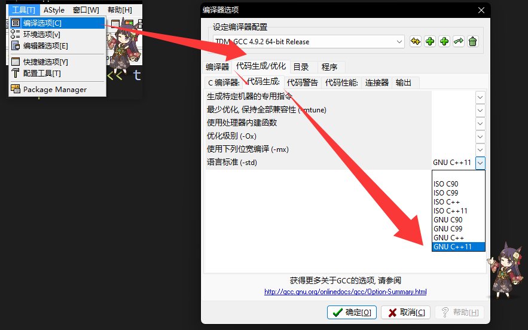

# cppjieba include/Readme

## 目录说明
- 本目录包含 cppjieba 头文件（供编译时包含），提供`demo.cpp`为`cppjieba`的使用示例。

## 依赖
- C++11 兼容编译器

## 使用说明

如果你使用DevCPP，确保启用C++11标准：
- 工具 —— 编译选项 —— 代码生成/优化 —— 代码生成 —— 语言标准 选择 GNU C++11

然后`F11`编译运行即可。输出文件`output.txt`如果与`std.txt`一致，说明环境没问题。

Jieba分词要求中文编码**必须**为`UTF-8`，否则分词将失败，请务必确保输入的中文字符串的编码为`UTF-8`。

但DevCPP仅支持以`GBK`方式打开文件，这会导致打开`UTF-8`文件显示的中文为乱码，因此请勿使用DevCPP编写中文进行分词。

如果你使用的是VSCode，确保右下角使用`UTF-8`编码进行打开和保存即可。

## 目录结构

### dict 文件夹说明
- 作用：存放 cppjieba 运行时所需的分词词典与模型文件，必须与程序在运行时可访问。
- 常见文件（UTF-8 编码）：
    - jieba.dict.utf8：主词典（核心词表）
    - hmm_model.utf8：HMM 模型（用于新词发现）
    - user.dict.utf8：用户自定义词典（可选）
    - idf.utf8：TF-IDF 所需的 idf 数据（用于关键词提取）
    - stop_words.utf8：停用词表（可选）
- 使用提示：确保以上文件为 UTF-8 编码；在构造 Jieba 对象或初始化分词器时传入这些文件的路径。

### 命令行编译示例
- `g++ -std=c++11 -O2 -I. -o demo demo.cpp`
- 运行前确保 dict 文件夹可访问：./demo （或在代码中使用绝对/相对路径加载词典）

## Jieba来源于https://github.com/yanyiwu/cppjieba