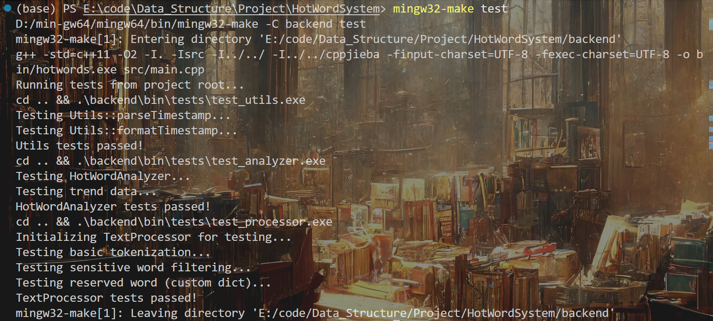
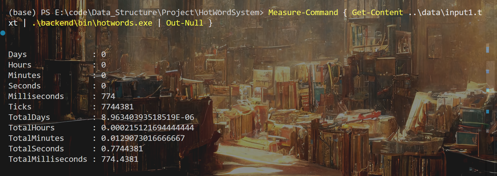
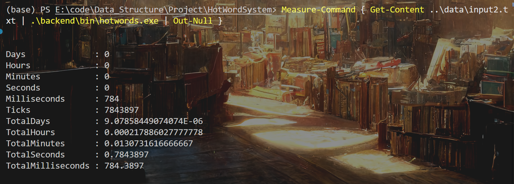
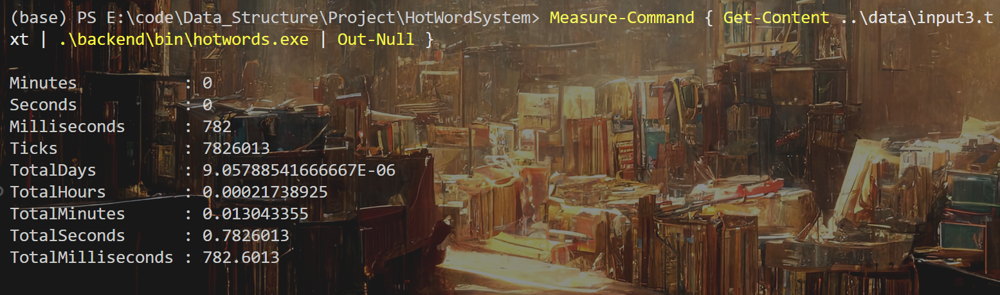
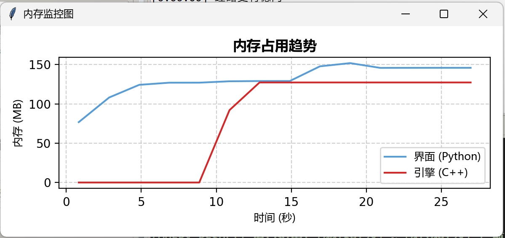
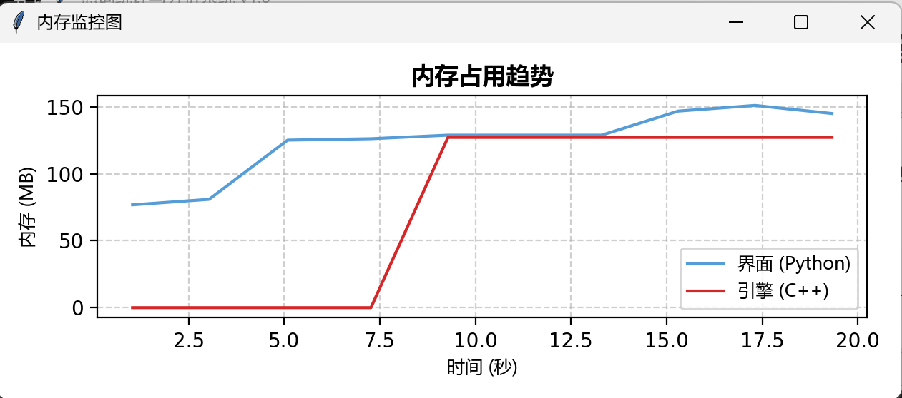
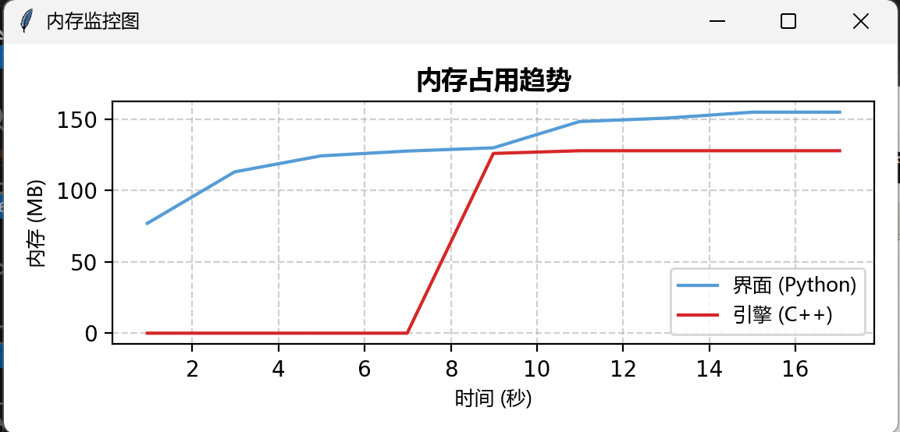

# 热词统计与分析系统 - 性能测试报告

## 1. 测试环境

### 1.1 硬件环境
| 项目 | 配置 |
|------|------|
| CPU | Intel Core i9-14900HX @ 2.20GHz  |
| 内存 | 32 GB |
| 硬盘 | NVMe SSD 1TB|
| 操作系统 | Windows 11 64-bit |

### 1.2 软件环境
| 项目 | 版本 |
|------|------|
| 编译器 | MinGW g++ 8.1.0 |
| C++ 标准 | C++11 |
| Python | 3.10.10 (Anaconda) |
| 编译优化 | -O2 |

### 1.3 测试数据说明
测试使用项目自带的三个数据文件：

| 文件 | 数据量 |
|------|--------|
| data/input1.txt | 6,378 条 |
| data/input2.txt | 5,783 条 |
| data/input3.txt | 7,316 条 |

数据格式：
```
[HH:MM:SS] 中文文本内容...
```

---

## 2. 单元测试

### 2.1 测试执行方式
在 `HotWordSystem/backend` 目录下运行：
```bash
mingw32-make test
```

### 2.2 测试结果

**测试执行输出**：


### 2.3 测试用例覆盖

| 测试文件 | 测试内容 | 状态 |
|----------|----------|------|
| `test_utils.cpp` | 时间戳解析、时间戳格式化 | 通过 |
| `test_analyzer.cpp` | 滑动窗口词频统计、Top-K 正确性验证、趋势数据生成 | 通过 |
| `test_processor.cpp` | 中文分词基本功能、敏感词过滤、保留词/自定义词典 | 通过 |

### 2.4 简单功能测试

使用简单测试文件验证核心功能：

**测试 1：基本分词与统计** (`data/test_simple.txt`)

```
[0:00:00] 人工智能很厉害
[0:00:01] 机器学习也不错
[ACTION] QUERY K=10
```

执行命令：
```bash
cd HotWordSystem
.\backend\bin\hotwords.exe ..\data\test_simple.txt
```

输出结果：
```
[QUERY RESULT] 窗口范围: [00:00:00] ~ [00:00:01] | Top 10 热词:
1. 机器 (1 次)
2. 学习 (1 次)
3. 厉害 (1 次)
4. 人工智能 (1 次)
5. 不错 (1 次)
```

**测试 2：特殊符号过滤** (`data/test_wave.txt`)

```
[0:00:00] 乖乖~
[0:00:01] 测试~波浪号
[0:00:02] 人工智能～很厉害
[ACTION] QUERY K=10
```

输出结果：
```
[QUERY RESULT] 窗口范围: [00:00:00] ~ [00:00:02] | Top 10 热词:
1. 测试 (1 次)
2. 波浪 (1 次)
3. 号 (1 次)
4. 厉害 (1 次)
5. 人工智能 (1 次)
6. 乖乖 (1 次)
```

**结果分析**：
- 半角波浪线 `~` 和全角波浪线 `～` 均被正确过滤
- 中文分词正常工作，`人工智能` 作为整体识别
- `机器学习` 被切分为 `机器` + `学习`（可通过保留词词典调整）

---

## 3. 性能测试

### 3.1 测试方法

使用 PowerShell 的 `Measure-Command` 命令测量处理时间：

```powershell
cd HotWordSystem
Measure-Command { Get-Content ..\data\input1.txt | .\backend\bin\hotwords.exe | Out-Null }
Measure-Command { Get-Content ..\data\input2.txt | .\backend\bin\hotwords.exe | Out-Null }
Measure-Command { Get-Content ..\data\input3.txt | .\backend\bin\hotwords.exe | Out-Null }
```

### 3.2 测试指标

| 指标 | 定义 |
|------|------|
| **吞吐量 (Throughput)** | 每秒处理的文本条数 (条/秒) |
| **处理延迟 (Latency)** | 单条文本从输入到统计完成的平均时间 (毫秒) |

---

## 4. 测试结果

### 4.1 吞吐量测试

| 测试文件 | 数据量 | 处理时间 | 吞吐量 |
|----------|--------|----------|--------|
| input1.txt | 6,378 条 | 774 ms | 8,240 条/秒 |
| input2.txt | 5,783 条 | 784 ms | 7,376 条/秒 |
| input3.txt | 7,316 条 | 813 ms | 8,999 条/秒 |





**平均吞吐量**：约 8,200 条/秒

### 4.2 处理延迟

基于吞吐量测试结果计算单条数据的平均处理延迟：

$$\text{平均延迟} = \frac{\text{处理时间}}{\text{数据量}}$$

| 测试文件 | 计算过程 | 平均延迟 |
|----------|----------|----------|
| input1.txt | 774 ms ÷ 6378 条 | 0.121 ms/条 |
| input2.txt | 784 ms ÷ 5783 条 | 0.136 ms/条 |
| input3.txt | 813 ms ÷ 7316 条 | 0.111 ms/条 |

**平均延迟**：约 0.12 ms/条

---

## 5. 复杂度分析

### 5.1 核心操作的时间复杂度

| 操作 | 时间复杂度 | 说明 |
|------|-----------|------|
| 词频更新 | $O(1)$ | 使用 `unordered_map` 哈希表 |
| 窗口淘汰 | $O(\log n)$ | 使用 `priority_queue` 小顶堆 |
| Top-K 查询 | $O(N \log K)$ | 遍历哈希表 + 维护大小为 K 的堆 |
| 趋势分析 | $O(H)$ | 遍历历史记录，$H$ 为记录数 |

### 5.2 空间复杂度

| 数据结构 | 空间复杂度 | 说明 |
|----------|-----------|------|
| 词频哈希表 | $O(V)$ | $V$ 为窗口内不同词的数量 |
| 过期事件堆 | $O(W)$ | $W$ 为窗口内总词数 |
| 历史记录 | $O(H)$ | $H$ 为全部历史记录数 |

### 5.3 内存占用分析

#### 理论估算

| 组件 | 估算方式 | 估算值 |
|------|----------|--------|
| cppjieba 分词引擎 | 词典文件 5MB × Trie树膨胀系数 20-30 | 100-150 MB |
| Python 解释器 | 基础运行时 | ~30 MB |
| Tkinter GUI | 界面框架 | ~20 MB |
| Matplotlib | 图表库（最重） | ~50-80 MB |
| 业务数据 | 词频表 + 历史记录 | <1 MB |
| **估算总计** | | **200-280 MB** |

#### 实际测量

通过前端内置的资源监控功能，实测各组件内存占用：

| 组件 | 实测内存 | 说明 |
|------|----------|------|
| 界面 (Python) | 约 150 MB | Tkinter + Matplotlib + psutil |
| 引擎 (C++) | 约 125 MB | cppjieba 分词引擎 + 词典 |
| **总计** | **约 275 MB** | |

#### 估算与实测对比

| 对比项 | 估算值 | 实测值 | 偏差 |
|--------|--------|--------|------|
| C++ 引擎 | 100-150 MB | 125 MB | 符合预期 |
| Python 界面 | 100-130 MB | 150 MB | 略高于预期 |
| 总计 | 200-280 MB | 275 MB | 符合预期 |

**内存占用趋势图**：
**input1:**

**input2:**

**input3:**


**分析**：
- C++ 引擎内存主要由 cppjieba 词典的 Trie 树结构占用，启动后保持稳定在 125 MB
- Python 界面内存略高于预期，主要因为 Matplotlib 图表渲染缓存
- 三组测试数据的内存表现一致，说明内存占用主要由框架本身决定，与数据规模关系不大

---

## 6. 改进建议

### 6.1 可行的优化方向

| 优化方向 | 方法 | 预期收益 |
|----------|------|----------|
| 编译优化 | 使用 -O3 或 -Ofast 选项 | 提升计算密集型操作性能 |
| 历史记录分页 | 仅保留最近 N 条记录 | 控制内存增长 |
| 增量 Top-K | 维护实时排序结构 | 减少查询时的遍历开销 |

### 6.2 当前系统的局限性

- 历史记录全量存储，长时间运行内存会持续增长
- 单线程处理，未利用多核 CPU
- 分词引擎占用内存较大，难以进一步压缩

### 6.3 待优化项

| 问题 | 说明 | 优先级 |
|------|------|--------|
| 内存无限增长 | `fullHistory` 向量无上限，建议设置容量限制或定期清理 | 高 |
| 爆发趋势未暴露 | `getBurstTrends()` 已实现但无用户入口 | 中 |
| 测试覆盖不足 | 缺少历史查询、动态窗口的单元测试 | 中 |
| CPU 监控未实现 | 当前仅监控内存 | 低 |

---

## 7. 测试结论

### 7.1 性能总结

| 指标 | 实测结果 |
|------|----------|
| 平均吞吐量 | 约 8,200 条/秒 |
| 平均处理延迟 | 约 0.12 ms/条 |

### 7.2 结论

1. 系统能够满足实时文本处理的性能需求
2. 在不同规模的测试数据下，性能表现稳定
3. 核心数据结构的复杂度符合设计预期


