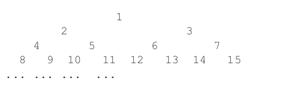
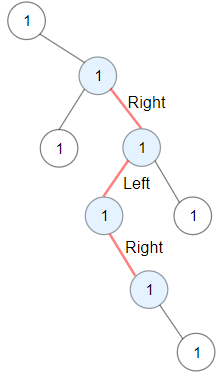
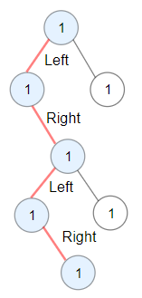

<div align="center">

# 中山大学计算机学院本科生实验报告 
### （2025学年第1学期）  
#### 课程名称：数据结构与算法　　　　实验任课教师：张子臻

</div>

| | | | |
|:---:|:---:|:---:|:---:|
|**年级**|2024级|**专业（方向）**|计算机科学与技术（人工智能与大数据）|
|**学号**|242325157|**姓名**|梁玮麟|
|**电话**|18620062182|**Email**|3371676041@qq.com|
|**开始日期**|2025.11.12|**结束日期**|2025.11.14|

## 第一题

### 1、实验题目

#### ⭐**z10-平衡二叉查找树判断**

给定一棵二叉查找树，其中结点上存储整数关键字。请你判断它是否是一棵平衡的二叉查找树，即每个内部结点的两颗子树高度差小于等于 1。

**输入描述**

第一行是测试样例个数，接下来是若干个测试样例。对于每个测试样例，第一行是二叉树结点个数，第二行是关键字序列，表示二叉树的先序遍历结果。假定关键字互不相同。


**输出描述**

如果二叉查找树是平衡的，则输出 "YES"，否则输出 "NO"。每个输出占一行。


**输入样例**

```

5
2
10 5
3
1 4 7
3
5 3 2
3
10 4 23
5
10 6 5 8 20

```

**输出样例**

```

YES
NO
NO
YES
YES

```


### 2、实验目的

- 通过先序遍历序列，掌握**重建二叉搜索树**的过程与实现方法。
- 理解**平衡二叉树**的定义，学会利用高度和**平衡因子**判断一棵树是否平衡。
- 练习使用递归对二叉树进行高度计算与性质判断。


### 3、算法设计

#### 设计思路

1. **根据先序序列重建 BST**

   先序遍历的第一个元素是根结点 `num[begin]`。  
   从 `begin+1` 开始向后扫描，直到遇到第一个大于根结点的元素，其下标记为 `right_begin`：

   - 区间 `[begin+1, right_begin-1]` 属于左子树；
   - 区间 `[right_begin, end]` 属于右子树。

   对左右区间递归调用建树函数即可重建整棵 BST。

2. **递归求高度并记录平衡因子**

   设计函数 `H(node *root)`：

   - 若 `root == nullptr`，说明是空树，高度为 0；
   - 否则递归计算左、右子树高度 `lheight`、`rheight`；
   - 当前结点高度为 `max(lheight, rheight) + 1`；
   - 平衡因子 `bf = lheight - rheight`，记录在结点中，为后续判断平衡准备数据。

3. **判断是否平衡**

   设计函数 `balance(node *root)`：

   - 空结点视作平衡；
   - 递归判断左右子树是否平衡；
   - 若左右子树都平衡，再检查当前结点是否满足 `abs(root->bf) <= 1`；
   - 若任一条件不满足，则整棵树不平衡。

4. **整体处理流程**

   对每个测试样例：

   - 读入结点数量和先序序列；
   - 通过 `build` 函数构建二叉搜索树；
   - 调用 `H(root)` 计算高度并更新平衡因子；
   - 调用 `balance(root)` 判断是否平衡，并输出结果。

#### 流程图

```cpp
// Flow of 判断二叉查找树是否平衡

start
|
|--> read m                              // 测试用例个数
|
|--> while (m--)
|       read n                          // 结点个数
|       read preorder array num[0..n-1] // 先序序列
|
|       root = build(num, 0, n - 1)     // 构建 BST
|       H(root)                         // 计算高度与平衡因子
|
|       if (balance(root))
|           print "YES"
|       else
|           print "NO"
|
end
```

#### 复杂度分析

* **建树阶段**

  对区间 `[begin, end]`，每一层递归都要在线性扫描中找到 `right_begin`，最坏情况下（例如严格单调序列）树退化为链表，递归深度为 `O(n)`，总的比较次数为
  `n + (n-1) + ... + 1 = O(n^2)`。

* **高度计算**

  `H(root)` 对每个结点访问一次，时间复杂度为 `O(n)`，递归栈深度为树高 `h`，空间 `O(h)`。

* **平衡判断**

  `balance(root)` 同样是对整棵树的一次 DFS，时间 `O(n)`，栈空间 `O(h)`。

* **综合：**

  * **总时间复杂度：** 最坏情况下为 `O(n^2)`；
  * **总空间复杂度：** 结点存储 `O(n)` + 递归栈 `O(h)`，整体为 `O(n)` 量级。

#### 细节注意

* 构造子树时注意边界的计算，尤其是`while`的循环条件`right_begin与end`和`num[right_begin] <= num[begin]`的关系。

#### 具体实现

```cpp
//z10-判断二叉查找树是否平衡
#include <iostream>
#include <vector>
#include <algorithm>
using namespace std;
class node {
  public:
    int val;
    int bf;
    node *left;
    node *right;
    node(int val) : val(val), bf(0),left(nullptr),right(nullptr) {}
    node() = default;
    ~node() = default;
};
node *build(vector<int> &num, int begin, int end) {
    if (begin > end) {
        return nullptr;
    } else {
        node *root = new node(num[begin]);
        int right_begin = begin;
        // 找到右子树的子节点
        while (num[right_begin] <= num[begin] && right_begin <= end) {
            right_begin++;
        }
        root->left = build(num, begin + 1, right_begin - 1);
        root->right = build(num, right_begin, end);
        return root;
    }
}
```

```cpp
int H(node *root) {
    if (root==nullptr) {
        return 0;
    } else {
        int lheight = H(root->left);
        int rheight = H(root->right);
        int height = max(lheight, rheight) + 1;
        root->bf = lheight - rheight;
        return height;
    }
}
bool balance(node *root) {
    if(!root) return true;
    if (balance(root->left) && balance(root->right)) {
        return abs(root->bf) <= 1;
    } else {
        return false;
    }
}
int main() {
    int m;
    cin >> m;
    while (m--) {
        vector<int> num;
        int n;
        cin >> n; // 读取数量
        for (int i = 0; i < n; i++) {
            // 读取数组
            int a;
            cin >> a;
            num.push_back(a);
        }
        // 构建树
        node *root = build(num, 0, n - 1);
        // 计算每个节点的高度
        H(root);
        if (balance(root)) {
            cout << "YES" << endl;
        } else {
            cout << "NO" << endl;
        }
    }
}
```

### 4、程序运行与测试


#### 运行结果：

##### 测试样例一

- 标准输入：
  
```cpp
5
2
10 5
3
1 4 7
3 
5 3 2
3
10 4 23
5
10 6 5 8 20
```

- 实际输出：
  
```cpp
YES
NO
NO
YES
YES

```

- 期望输出：
  
```cpp
（同上）
```

##### 测试样例二

- 标准输入：
  
```cpp
1
29
19	6	15	0	22	9	17	10	25	7	21	3	27	5	12	28	26	18	2	14	24	11	23	16	20	4	8	13	1	

```

- 实际输出：
  
```cpp
NO

```

- 期望输出：
  
```cpp
（同上）
```


### 5、实验总结与心得

* 本题让我再次熟悉了**二叉搜索树的构建过程**，尤其是如何仅凭先序序列恢复出左右子树的区间。区别于一般的二叉树，因为搜索树**默认左边比右边小**，所以仅凭先序表达式即可构建出树。
* 在实现高度计算和判断平衡时，体会到了**自底向上的递归**非常自然：在返回高度的同时顺便更新平衡因子，为下一步判断提供依据。
* 通过本题，我对“平衡二叉树”的直观理解更深刻，也意识到了不合理输入（例如单调序列）会使 BST 退化、从而导致时间复杂度恶化到 `O(n^2)`。

---

## 第二题

### 1、实验题目

#### ⭐ **z10-完全二叉树–最近公共祖先**

**题目描述**

如下图，由正整数`1，2，3，...`组成一棵无限大的满二叉树。从某一个结点到根结点（编号是1的结点）都有一条唯一的路径，比如10到根节点的路径是`(10,5,2,1)`，由4到根节点的路径是`(4,2,1)`，从根结点1到根结点的路径上只包含一个结点1，因此路径是(1)。
对于两个结点X和Y,假设它们到根结点的路径分别是`(X1,X2,...,1)`和`(Y1,Y2,...,1)`(这里显然有`X=X1,Y=Y1`)，那么必然存在两个正整数i和j，使得从Xi和Yj开始，`Xi=Yj,Xi+1=Yj+1，...`，现在的问题就是，给定X和Y，要求Xi(也就是Yj)。




**输入描述**

输入的第一行是一个整数 T，表示测试用例个数。以下 T 行，每行对应一个测试用例。
每个测试用例包括两个整数 X 和 Y，这两个整数都不大于 1000。


**输出描述**

对每个测试用例，单独一行输出一个整数 Xi。


**输入样例**

```
2
10 4
7 13
```

**输出样例**

```
2
3
```


### 2、实验目的

* 理解完全二叉树使用数组编号时的父子关系（`i` 的父结点为 `i / 2`）。
* 掌握在这种特殊结构下，如何通过“**回溯到根 + 比较路径**”求解最近公共祖先。
* 体会针对具体结构设计简单高效算法的思想。

### 3、算法设计

#### 设计思路

1. **构造从根到某个结点的路径**

   在这棵树里，任意结点 `num` 的父结点是 `num / 2`。
   因此，从结点 `num` 一直整除 2，就能回溯到根结点 1。

   为了得到“从根到结点”的顺序，设计函数 `find(path, root, num)`：

   * 从 `num` 开始，循环：

     * 将 `num` 加入 `path`；
     * 若 `num == root` 结束；否则 `num /= 2`；
   * 最后调用 `reverse(path.begin(), path.end())`，就能得到从 `root` 到原始结点的路径。

2. **得到 X 与 Y 的两条路径**

   对于给定的一组 `(x, y)`：

   * 调用 `find(xpath, 1, x)` 得到从根到 `x` 的路径；
   * 调用 `find(ypath, 1, y)` 得到从根到 `y` 的路径。

3. **比较路径前缀，找到最近公共祖先**

   两个结点的公共祖先，必定出现在这两条“从根到结点”的路径公共前缀中。
   从开头开始同步遍历：

   * 从 `i = 0` 起，若 `xpath[i+1]` 和 `ypath[i+1]` 都存在且相等，则 `i++`；
   * 一旦不再相等或越界，说明上一个位置 `xpath[i]` 就是最后一个公共结点，即最近公共祖先。

4. **对所有测试用例重复上述过程并输出答案**。

#### 流程图

```cpp
// Flow of 完全二叉树上求最近公共祖先

start
|
|--> read T                                // 测试用例个数
|
|--> while (T--)
|       read x, y
|
|       build xpath from x up to 1        // 不断 num /= 2
|       build ypath from y up to 1
|       reverse xpath, ypath              // 变成从根到结点
|
|       i = 0
|       while xpath[i+1] 和 ypath[i+1] 存在且相等
|             i++
|
|       print xpath[i]                    // 最近公共祖先
|
end
```

#### 复杂度分析

* **构造路径：**
  对于一个数 `num`，不断执行 `num /= 2`，次数约为 `O(log num)`，因此 `find` 的时间复杂度为 `O(log num)`，空间复杂度为 `O(log num)`（用来存储路径）。

* **比较路径：**
  最多比较 `O(log max(x, y))` 个结点。

* **综合：**

  对每个测试用例：

  * 时间复杂度为 `O(log x + log y)`，在输入约束 `x, y ≤ 1000` 下非常小；
  * 额外空间复杂度为 `O(log x + log y)` 存储两条路径。

#### 细节注意

* **注意vector记得reverse**！否则需要从末尾开始比较。**不要vector.reverse()!**

#### 具体实现

```cpp
//z10-完全二叉树-最近公共祖先
#include<iostream>
#include<vector>
#include<algorithm>
using namespace std;
void find(vector<int>& path,int root,int num){
    while(num!=root){
        path.push_back(num);
        num/=2;
    }
    path.push_back(root);
    reverse(path.begin(),path.end());
}
int main(){
    int n;
    cin>>n;
    while(n--){
        int x,y;
        cin>>x>>y;
        vector<int> xpath;
        vector<int> ypath;
        find(xpath,1,x);
        find(ypath,1,y);
        int i=0;
        while(xpath[i+1]&&ypath[i+1]&&xpath[i+1]==ypath[i+1]){
            i++;
        }
        cout<<xpath[i]<<endl;
        
    }
    return 0;
}
```

### 4、程序运行与测试


##### 测试样例一

- 标准输入：
  
```cpp
4000
1 1
1 2
1 3
1 4
1 5
1 6
1 7
1 8
1 9
...
2 1
2 2
2 3
2 4
2 5
2 6
2 7
...
```

- 实际输出：
  
```cpp
(通过)
```

- 期望输出：
  
```cpp
(通过)
```

##### 测试样例二

- 标准输入：
  
```cpp
2
10 4
7 13

```

- 实际输出：
  
```cpp
2
3

```

- 期望输出：
  
```cpp
2
3

```

### 5、实验总结与心得

* 这道题充分利用了完全二叉树“**用下标表示结点**”的特性，通过不断 `/2` 直接获得父结点，避免了真正建树。
* 通过“从根到结点”的路径比较，很直观地理解了**最近公共祖先就是公共前缀中最后一个结点**这一思想，也让我对 LCA 有了更形象的认识。
* 与普通树上复杂的 LCA 算法相比，本题的解法简单却高效，让我意识到：**善用结构特性，可以让问题变得非常好做。**

---

## 第三题

#### ⭐ **z10-交错路径**

**题目描述**

给你一棵以 root 为根的二叉树，二叉树中的交错路径定义如下：

* 选择二叉树中任意节点，节点具有一个方向（左或者右）；
* 如果当前节点方向为右，那么移动到当前节点的右子节点，否则移动到它的左子节点；
* 改变前进方向：左→右 或 右→左；
* 重复上述步骤，直到遇到无法继续的情况。

交错路径长度定义为：访问过的节点数目 − 1。

请你返回给定树中最长**交错路径**的长度。


树节点数据结构定义如下：

```cpp
struct TreeNode
{
    int val;
    TreeNode *left;
    TreeNode *right;
};
```

需要实现的函数为：

```cpp
#include "TreeNode.h"
int longestZigZag(TreeNode *root);
```

**输入样例（示例一）**


```cpp
root = [1,null,1,1,1,null,null,1,1,null,1,null,null,null,1]
输出：3
解释：蓝色节点构成最长交错路径（右→左→右）。
```

**输入样例（示例二）**


```cpp
root = [1,1,1,null,1,null,null,1,1,null,null,null,null,1,null,1]
输出：4
解释：蓝色节点构成最长交错路径（左→右→左→右）。
```

### 2、实验目的

* 理解交错路径（左右方向交替）的定义及其在二叉树中的表现形式。
* 学会在递归函数中传入“**当前方向**”等附加状态，以表示路径延伸的要求。
* 掌握利用递归同时维护**局部状态**和**全局最优答案**（例如通过引用参数）的技巧。

### 3、算法设计

#### 设计思路

1. **设计带方向状态的递归函数**

   定义辅助函数：

   ```cpp
   int solve(TreeNode *p, int dirct, int &maxlen);
   ```

   其中：

   * `p`：当前结点；
   * `dirct`：当前结点相对于父结点的方向：

     * `dirct = 0` 表示 `p` 是父结点的**左子结点**，下一步应该去 `p->right`；
     * `dirct = 1` 表示 `p` 是父结点的**右子结点**，下一步应该去 `p->left`；
   * `maxlen`：引用参数，用于在整个 DFS 过程中实时维护“目前发现的最长交错路径长度”。

2. **递归转移规则**

   * 若 `p == nullptr`，则无法再延伸交错路径，返回 0。

   * 当 `dirct == 0`（当前是左子结点）时：

     * 若要让路径继续交错，下一步需要走到 `p->right`，于是有一条路径：

       ```cpp
       int path = 1 + solve(p->right, 1, maxlen);
       ```
     * 另外，为了考虑从当前结点的左子树内部开始的新交错路径，还递归调用：

       ```cpp
       int lpath = solve(p->left, 0, maxlen);
       ```
     * 使用 `maxlen = max(maxlen, max(lpath, path));` 更新全局答案；
     * 返回值选择继续延伸的那条 `path`，用于父结点方向上的拼接。

   * 当 `dirct == 1`（当前是右子结点）时，逻辑与上面对称：

     * 一条路径从 `p` 出发向左子结点继续交错；
     * 同时递归考察 `p->right` 子树内部的交错路径；
     * 同样用 `maxlen` 进行全局更新，函数返回“向左延伸”的那条路径长度。

3. **从根节点开始尝试两种方向**

   交错路径可以从树中任意结点开始，因此在 `longestZigZag` 中：

   * 若 `root` 为空，直接返回 0；
   * 否则以 `root->left` 为起点、方向记为 0 调用 `solve`；
   * 以 `root->right` 为起点、方向记为 1 调用 `solve`；
   * 在递归过程中已经不断更新 `maxlen`，最后再用左右两条路径对 `maxlen` 做一次比较，即可得到最终答案。

#### 流程图

```cpp
// Flow of longestZigZag(root)

start
|
|--> if (root == nullptr)
|       return 0
|
|--> maxlen = 0
|
|--> solve(root->left,  0, maxlen)    // 0 表示当前是左子结点
|--> solve(root->right, 1, maxlen)    // 1 表示当前是右子结点
|
|--> return maxlen
|
end

// Flow of solve(p, dirct, maxlen)

start
|
|--> if (p == nullptr)
|       return 0
|
|--> if (dirct == 0)                      // 当前是左子结点
|       path  = 1 + solve(p->right, 1, maxlen)
|       lpath =     solve(p->left,  0, maxlen)
|       maxlen = max(maxlen, max(path, lpath))
|       return path
|
|--> else                                 // 当前是右子结点
|       rpath =     solve(p->right, 1, maxlen)
|       path  = 1 + solve(p->left,  0, maxlen)
|       maxlen = max(maxlen, max(path, rpath))
|       return path
|
end
```

#### 复杂度分析

* **递归访问次数：**
  每个结点在递归过程中被访问常数次，因此整体访问次数与结点数 `n` 同阶，为 `O(n)`。

* **递归栈深度：**
  最深不会超过树高 `h`，最坏情况下（退化成链表）为 `O(n)`，对于平衡树则约为 `O(log n)`。

* **综合：**

  * 总时间复杂度：`O(n)`；
  * 总空间复杂度：`O(h)`（主要来自递归栈，最坏 `O(n)`）。

#### 细节注意

* `solve`记录的是交错路径，不是当前节点的最大交错路径长度！所以需要一个`maxlen`来返回长度。
* 我最开始的想法其实是，对于每个节点都计算向左和向右**两条交错路径**，然后再递归一遍**所有节点找到最大值**。这样需要`unoredered_map`来记录重复节点，同时**需要写两个递归函数**。
* 对于现在这种做法，观察到，**如果父节点向左走到子节点，那么子节点再向左其实是交错路径没有考虑到的。只要补上一个lpath，即可遍历所有节点**。有右边同理。所以如果每一个节点都这么操作，不但代码量减少，并且仅需遍历一次。

#### 具体实现

```cpp
#include "TreeNode.h"
#include <iostream>
#include <algorithm>
using namespace std;
int solve(TreeNode *p, int dirct, int &maxlen) {
    // dirct=0，代表p是父节点的左子节点，dirct=1，代表p节点是父节点的右子节点
    //solve依然用于计算交错路径，但是设置一个maxlen用于维护答案。
    if (p) {
        if (dirct == 0) {
            int path = 1 + solve(p->right, 1,maxlen);
            int lpath = solve(p->left, 0, maxlen);
            // 如果继续考虑右节点，这个时候其实就是上面那条代码。而这条路径一定小于path，所以考虑path和lpath比较
            maxlen = max(maxlen, max(lpath, path));
            return path;
        } else {
            int rpath = solve(p->right, 1, maxlen);
            int path=1 + solve(p->left, 0, maxlen);
            maxlen = max(maxlen, max(rpath, path));
            return path;
        }
    }else{
        return 0;
    }
}
int longestZigZag(TreeNode *root) {
    if (!root)
        return 0;
    else {
        int maxlen = 0;
        int lpath=solve(root->left, 0, maxlen);
        int rpath=solve(root->right, 1, maxlen);
        maxlen=max(maxlen,max(rpath,lpath));
        return maxlen;
    }
}
```

### 4、程序运行与测试

##### 测试样例二

- 标准输入：
  
```cpp

```

- 实际输出：
  
```cpp
Yes
Yes
Yes
Yes
Yes

```

- 期望输出：
  
```cpp
Yes
Yes
Yes
Yes
Yes

```

### 5、实验总结与心得

* 这题的关键在于把“**交错**”这个概念翻译成代码中的“**方向状态**”。通过在递归函数里加入 `dirct` 参数，就可以控制下一步应该往左还是往右。
* 通过引用参数 `maxlen` 在 DFS 过程中不断更新答案，我对“搜索 + 全局变量/引用维护最优解”的模式更加熟悉。
* 与前两题同样是二叉树问题不同，本题更强调**路径形状**而不是结构信息，让我意识到同一棵树可以从很多不同角度去思考与建模。
* 这题卡了我很久很久，最后发现是没有分清楚**当前节点的交错路径与当前节点的最大交错路径的区别**。前者通过递归得到父节点的交错路径答案，但是**后者无法递归**！！！
