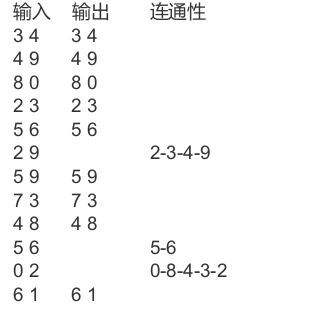

# 中山大学计算机学院本科生实验报告 
### （2025学年第1学期）  
#### 课程名称：数据结构与算法　　　　实验任课教师：张子臻

| | | | |
|:---:|:---:|:---:|:---:|
|**年级**|2024级|**专业（方向）**|计算机科学与技术（人工智能与大数据）|
|**学号**|242325157|**姓名**|梁玮麟|
|**电话**|18620062182|**Email**|3371676041@qq.com|
|**开始日期**|2025.11.19|**结束日期**|2025.11.22|

---

# 第一题

## 1、实验题目

### ⭐ **z11-家族查询**

**题目描述**

某个家族人员过于庞大，要判断两个人是否是亲戚，确实还很不容易，现在给出某个亲戚关系图，求任意给出的两个人是否具有亲戚关系。

规定：x 和 y 是亲戚，y 和 z 是亲戚，那么 x 和 z 也是亲戚。如果 x、y 是亲戚，那么 x 的亲戚都是 y 的亲戚，y 的亲戚也是 x 的亲戚。（人数 ≤ 5000，询问次数 ≤ 5000）

**输入描述**

第一行为数据组数 T（T ≤ 20）

对于每组数据，第一行有两个整数 n、m（1 ≤ n, m ≤ 5000），表示有 n 个人，编号 1~n，其中存在 m 个亲戚关系。

接下来 m 行，每行有两个整数 u、v（1 ≤ u, v ≤ n），表示 u 和 v 之间有亲戚关系。

然后是询问数量 q（1 ≤ q ≤ 5000）

接下来 q 行，每行有两个整数 u、v（1 ≤ u, v ≤ n），询问 u 和 v 之间是否具有亲戚关系。

**输出描述**

对于每组数据，输出 q 行，每行为 “Yes” 或 “No”。

每组数据之间空行隔开。

**输入样例**

```cpp
2
3 1
2 3
2
1 2
2 3
4 2
1 2
1 4
3
1 2
1 3
2 4
```

**输出样例**

```cpp
No
Yes

Yes
No
Yes
```

---

## 2、实验目的

- 结合并查集（**Union-Find**）解决集合之间“是否属于同一组”的判定问题。
- 学习路径压缩与查找优化策略。
- 掌握对多组数据独立维护并查集结构的处理方式。

---

## 3、算法设计

### 设计思路

1. **使用并查集表示亲戚关系**

   - 每个人作为一个集合的元素，若 u 和 v 为亲戚，则合并其所在集合。

2. **find 函数带路径压缩**

   - 查找一个节点的根，同时将沿途节点**全部直接指向根节点**以加速后续查询。

3. **合并操作**

   - 若 u、v 的根不同，将两个根合并，使得两个集合成为一个集合。

4. **查询操作**

   - 若 find(u) == find(v)，则输出 "Yes"，否则输出 "No"。

---

### 流程图

```cpp
Start
 |
 |--> Read T
 |
 |--> Loop T times:
 |        Read n, m
 |        初始化 parent[i] = i
 |
 |        For m relations:
 |            Read u, v
 |            find roots ru, rv
 |            parent[rv] = ru
 |
 |        Read q
 |        For each query:
 |            Read u, v
 |            If find(u) == find(v)
 |                Print "Yes"
 |            Else print "No"
 |
End
```

---

### 复杂度分析

- **查找（带路径压缩）**：近似 O(α(n))，可视为常数时间。
- **合并 m 次关系**：O(m α(n))。
- **q 次查询**：O(q α(n))。
- **总体时间复杂度**：O((m + q) α(n))。
- **总体空间复杂度**：O(n)。

---

### 细节注意

- 合并两个集合的时候可以继续优化。因为当前代码实现的只是**随机挑选一棵树放在另一棵树下**。可以比较两棵树的大小，高度，然后再全部放进另一棵树的根节点下。

---

### 具体实现

```cpp
//z11-家族查询
#include<iostream>
#include<vector>
using namespace std;
int find(int a,vector<int>& parent){
    return parent[a]==a? a:(parent[a]=find(parent[a],parent));
}
int main(){
    int T;
    cin>>T;
    while(T--){
        int n,m;
        cin>>n>>m;
        vector<int> parent(n+1);
        for(int i=0;i<n+1;i++){
            parent[i]=i;
        }
        while(m--){
            int u,v;
            cin>>u>>v;
            int ru=find(u,parent);
            int rv=find(v,parent);
            parent[rv]=ru;
        }
```

```cpp
        int q;
        cin>>q;
        while(q--){
            int u, v;
            cin>>u>>v;
            cout<<(find(u,parent)==find(v,parent)? "Yes":"No")<<endl;
        }
    }
    return 0;
}
```

---

## 4、程序运行与测试


#### 运行结果：

##### 测试样例一

- 标准输入：
  
```cpp
16
3847   3521
3644   868
3748   1402
3379   3440
360   303
951   2845
533   320
893   595
644   393
143   41
1016   1008
...

```

- 实际输出：
  
```cpp
No
No
Yes
No
No
No
...

```

- 期望输出：
  
```cpp
（同上）
```

##### 测试样例二

- 标准输入：
  
```cpp
15
1478   1799
1292   1415
312   1209
65   1422
488   337
725   628
1325   715
501   557
...

```

- 实际输出：
  
```cpp
Yes
Yes
Yes
No
Yes
Yes
No
...
```

- 期望输出：
  
```cpp
（同上）
```


---

## 5、实验总结与心得

- 本题通过亲戚关系的传递性抽象为**集合合并**问题，进一步加深了对并查集的理解。
- find 的路径压缩让查询效率极高，在大量数据下优势明显。
- 多组数据独立处理，也让我体会到初始化与作用域控制的重要性。

---

# 第二题

## 1、实验题目

### ⭐ **z11-连通性问题**

**题目描述**

关系具有对称性和传递性。数对 p q 表示 p R q，p 和 q 是自然数，p ≠ q。  
要求写一个程序将数对过滤，如果一个数对可以通过前面数对的传递性得到，则将其滤去。例如：



其中数对 2 9 和 0 2 可以由之前数对的连通性关系得到，故不做输出。

**输入描述**

共 m 行（0 ≤ m ≤ 1,000,000），每行一个数对。数字之间以空格分隔；数对中的数字为 0 或 ≤100000 的自然数。

**输出描述**

输出过滤后的数对序列。每行一个数对，数字之间以空格分隔。

**输入样例**

```cpp
3 4
4 9
8 0
2 3
5 6
2 9
5 9
7 3
4 8
5 6
0 2
6 1
```

**输出样例**

```cpp
3 4
4 9
8 0
2 3
5 6
5 9
7 3
4 8
6 1
```

---

## 2、实验目的

- 理解连通性的传递闭包判断。
- 使用**并查集**动态维护连通分量，并判断某个数对是否“已经可达”。
- 结合大量输入（最多百万行），训练高效输入处理能力。

---

## 3、算法设计

### 设计思路

1. **并查集 father[i] 初始化指向自身**

2. **对每个输入的数对 (m, n)**：

   - 找到 rm = find(m), rn = find(n)。
   - 若 rm ≠ rn，则输出该数对（表示此前未连通）。
   - 否则表示已可达，不输出。

3. **按高度合并 root，使并查集结构更平衡。**

4. **若 rm==rn，则执行路径压缩，让后续查找更高效。**

---

### 流程图

```
Start
 |
 |--> 初始化 father[i]=i
 |
 |--> While 读入 m,n:
 |         rm = m, rn = n
 |         沿 father 链找到各自根，同时统计高度
 |         If rm != rn:
 |               Print m n
 |               将高度较小的根连到较大的根
 |         Else:
 |               对 m,n 执行路径压缩，让它们直接指向 rm
 |
End
```

---

### 复杂度分析

- **find**：带路径压缩，均摊 O(α(n))。
- **m 次输入处理**：总计 O(m α(n))。
- **空间复杂度**：O(n)。

---

### 细节注意

- 这里实际上并非按照高度合并，而是按照**查找路径的长度**合并。
- 路径压缩可以直接用一个`find()`函数解决，在做这一题的时候我还不知道具体怎么写。可以优化写法。
- 这里我使用了**不太规范的按秩合并和写法不太规范的路径压缩**。应当可以改进。

---

### 具体实现

```cpp
//z11-连通性问题
#include<iostream>
#include<vector>
using namespace std;
#define MAXLEN 100001
int main(){
    int m,n;
    vector<int> father(MAXLEN);
    for(int i=0;i<MAXLEN;i++){
        father[i]=i;
    }
    while(cin>>m>>n){
        int rm=m,rn=n;
        int heightm=0,heightn=0;
        while(father[rm]!=rm){
            rm=father[rm];
            heightm++;
        }
        while(father[rn]!=rn){
            rn=father[rn];
            heightn++;
        }
        if(rm!=rn){
            cout<<m<<" "<<n<<endl;
            if(heightm<heightn){
                father[rm]=rn;
            }else{
                father[rn]=rm;
            }
        }else{
```

```cpp
            while(m!=rm){
                int tempm=m;
                m=father[m];
                father[tempm]=rm;
            }
            while(n!=rn){
                int tempn=n;
                n=father[n];
                father[tempn]=rn;
            }
        }
    }
    return 0;
}
```

---

## 4、程序运行与测试


##### 测试样例一

- 标准输入：
  
```cpp
3 4
4 9
8 0
2 3
5 6
2 9
5 9
7 3
4 8
5 6
0 2
6 1

...

```

- 实际输出：
  
```cpp
3 4
4 9
8 0
2 3
5 6
5 9
7 3
4 8
6 1

```

- 期望输出：
  
```cpp
3 4
4 9
8 0
2 3
5 6
5 9
7 3
4 8
6 1

```

##### 测试样例二

- 标准输入：
  
```cpp
1 563
193 808
585 479
350 895
822 746
174 858
710 513
303 14
91 364
...
```

- 实际输出：
  
```cpp
1 563
193 808
585 479
350 895
822 746
174 858
710 513
...
```

- 期望输出：
  
```cpp
（同上）
```

---

## 5、实验总结与心得

- 加深了对“**连通性 & 传递性**”的抽象能力。以后碰到这种，将**一堆数据整理成一类**的（比如说第一题中的家族成员之间可以互相访问到，还有这一题中的根据多个节点后数据也可以互相访问的）都可以考虑并查集
- 本题需要处理百万级别输入，要求程序必须足够高效。
- 并查集的高度优化与路径压缩在此题中体现得非常明显。

---

# 第三题

## 1、实验题目

### ⭐ **z11-多叉树与二叉树**

**题目描述**

给出一棵有 n 个点的以 1 为根节点的有根多叉树，请把它转换成左儿子右兄弟的二叉树形式，并输出其层次遍历顺序。

注意，一个节点的左儿子一定使用它的所有儿子中编号最小的，右兄弟一定使用比它编号大的兄弟中最小的兄弟节点。层次遍历需按照自上而下，自左而右访问树的节点。

**输入描述**

第 1 行：有根多叉树的节点数 n（1 ≤ n ≤ 100000）

**第 2 行到第 n 行：第 i 行表示 i 号节点的父亲节点 f[i]。(1 ≤ f[i] < i)**

**输出描述**

一行，用空格分开，层次遍历顺序。

**输入样例**

```
5
1
2
3
1
2
```

**输出样例**

```
1 2 5 3 4
```

---

## 2、实验目的

- 理解**多叉树到二叉树**（**左儿子右兄弟**）表示方式的转换。
- 掌握如何用数组记录父节点，并在遍历中构造对应的二叉树结构。
- 提高对树结构层序遍历的理解。

---

## 3、算法设计

### 设计思路

1. **记录每个节点的父亲**

2. **构造左儿子与右兄弟指针结构**

   - 某节点 i 的父亲为 f，则：
     - 若 father[f] 还没有左儿子，则 leftchild[f] = i。
     - 若 father[f] 已有左儿子，则将其 lastchild 链到 rightchild。
   - 将当前节点更新为父亲的 lastchild ，方便将下一个访问到相同父亲的节点设置为当前节点的右子节点。

3. **使用队列进行层次遍历**

   - 初始 push(1)
   - 对当前节点：
     - 输出自身
     - push 左儿子
     - push 右兄弟

---

### 流程图

```
Start
 |
 |--> Read n
 |--> Init arrays father[], leftchild[], rightchild[], lastchild[]
 |
 |--> For i = 1..n-1:
 |        Read Father
 |        father[i] = Father
 |        if leftchild[Father] == 0:
 |             leftchild[Father] = i+1
 |        if lastchild[Father] != 0:
 |             rightchild[lastchild[Father]] = i+1
 |        lastchild[Father] = i+1
 |
 |--> BFS:
 |       queue push(1)
 |       While queue not empty:
 |            cur = front
 |            if cur != 0:
 |                print cur
 |                push(leftchild[cur])
 |                push(rightchild[cur])
 |            pop
 |
End
```

---

### 复杂度分析

- **构造阶段**：遍历 n 次，每次 O(1)，因此 O(n)。
- **层序遍历**：访问每节点与指针一次，O(n)。
- **总时间复杂度**：O(n)。
- **空间复杂度**：O(n)。

---

### 细节注意

- 实际上我有一版真的自定义node类，然后建树的版本：
```cpp
#include <iostream>
#include <unordered_map>
#include <queue>
using namespace std;
class node {
  public:
    int pos;
    node *left;
    node *right;
    node() = default;
    node(int pos) : pos(pos), left(nullptr), right(nullptr) {}
    ~node(){
        if(left) delete left;
        if(right) delete right;
    }
};
node *solve(vector<int> &num, unordered_map<int, queue<int>> &hash, int idx) {
    node *root = new node(idx + 1);
    // 找左子节点
    if (hash.count(idx + 1)) {
        int leftchild = hash[idx + 1].front();
        hash[idx + 1].pop();
        if (hash[idx + 1].empty()) {
            hash.erase(idx + 1);
        }
        root->left = solve(num, hash, leftchild);
    }
```

```cpp
    //右子节点，也就是兄弟节点
    if (hash.count(num[idx])) {
        int rightchild = hash[num[idx]].front();
        hash[num[idx]].pop();
        if (hash[num[idx]].empty()) {
            hash.erase(num[idx]);
        }
        root->right = solve(num, hash, rightchild);
    }
    return root;
}
int main() {
    int n;
    cin >> n;
    vector<int> num(n);
    unordered_map<int, queue<int>> hash; // father's pos->child's idx
    num[0] = 0;
    for (int i = 1; i < n; i++) {
        cin >> num[i];
        hash[num[i]].push(i);
    }
    node *root = solve(num, hash, 0);
    queue<node *> result;
    result.push(root);
    while (!result.empty()) {
        node *cur = result.front();
        if (cur) {
            result.push(cur->left);
            result.push(cur->right);
            cout << cur->pos << " ";
        }
        result.pop();
    }
    delete root;
    return 0;
}
//首次使用int queue的hash
//层序遍历
//树形结构释放
```

但是这种做法相当于把所有的数据全部存起来，超过了内存限制，而且也没有真正用上条件：
**第 2 行到第 n 行：第 i 行表示 i 号节点的父亲节点 f[i]。(1 ≤ f[i] < i)**
- 我想了很久之后，才想明白可以不用构建树，只需要记录每个节点的**左子节点和右子节点**即可。为了更方便地维护这两个数组，才衍生了**father和lastchild两个数组**。
- 第一次学会层序遍历。用队列的想法很新奇。
---

### 具体实现

```cpp
#include<iostream>
#include<queue>
#include<vector>
using namespace std;
int main(){
    int n;
    cin>>n;
    vector<int> father(n);//当前索引对应的父节点
    vector<int> leftchild(n);//当前节点的左子节点
    vector<int> rightchild(n);//当前节点的右子节点
    vector<int> lastchild(n);//当前节点的最后一个右子节点
    father[0]=0;
    rightchild[0]=0;
    lastchild[0]=0;
    //leftchild[0]待定
    for(int i=1;i<n;i++){
        int Father;
        cin>>Father;
        father[i]=Father;//索引为i的父节点是father
        if(leftchild[Father]==0){
            leftchild[Father]=i+1;
        }
        if(lastchild[Father]!=0){
            int brother=lastchild[Father];//同一个父亲的左兄弟
            rightchild[brother]=i+1;
        }
        lastchild[Father]=i+1;
    }
```

```cpp
    queue<int> result;
    result.push(1);//放入根节点
    while(result.empty()==0){
        int cur=result.front();
        if(cur!=0){
            cout<<cur<<" ";
            result.push(leftchild[cur]);
            result.push(rightchild[cur]);
        }
        result.pop();
    }
    return 0;
}
```

---

## 4、程序运行与测试


#### 运行结果：

##### 测试样例一

- 标准输入：
  
```cpp
78368
1
1
1
1
1
1
3

...

```

- 实际输出：
  
```cpp
1 2 9 3 17 14 8 4 27 20 103 39 12 10 21 5 47 36 43 25 139 147 46 40 23 42 13 11 248 32 24 6 204 171 122 186 226 52 430 975 578 843 542 223 81 59 
...

```

- 期望输出：
  
```cpp
（同上）
```

##### 测试样例二

- 标准输入：
  
```cpp
92053
1
1
1
1
1
5
3
7

...

```

- 实际输出：
  
```cpp
1 2 23 3 30 61 8 4 728 416 1159 130 33 14 12 5 1513 990 649 463 1348 172 338 75 261 39 17 16 53 
...
```

- 期望输出：
  
```cpp
（同上）
```


---

## 5、实验总结与心得

- 本题让我熟悉了“**左儿子右兄弟**”这种树的二叉化方式。虽然原理很直观，但是具体实现方式还是很重要的。
- 理解了为什么需要 **lastchild** 来维护兄弟链表。
- **层次遍历过程直观**，但要求结构构造准确，否则输出顺序会错乱。
