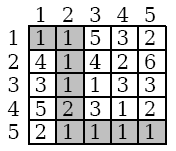

# 中山大学计算机学院本科生实验报告


### （2025学年第1学期）

#### 课程名称：数据结构与算法　　　　实验任课教师：张子臻

|          |             |            |                                               |
| :------: | :---------: | :--------: | :-------------------------------------------: |
|  **年级**  |    2024级    | **专业（方向）** |               计算机科学与技术（人工智能与大数据）              |
|  **学号**  |  242325157  |   **姓名**   |                      梁玮麟                      |
|  **电话**  | 18620062182 |  **Email** | [3371676041@qq.com](mailto:3371676041@qq.com) |
| **开始日期** |  2025.12.24 |  **结束日期**  |                   2025.12.25                    |

---
# 第一题

## 1、实验题目

### ⭐ **z16-All pairs shortest path**

**题目描述**

N cities named with numbers 1 · · · N are connected with one-way roads. For each pair of cities i and j, you need to find the shortest path from city i to city j.

**输入描述**

The first line contains three integers N, K and Q(2 ≤ N ≤ 100, 1 ≤ K ≤ 10000, 1 ≤ Q ≤ 10000). N is the number of cities, K is the number of roads, and Q is the number of queries. Each of following K lines contains three integers i, j, d(1 ≤ i, j ≤ N, 0 < d < 10000), indicates there is a road from city i to city j, and its length is d. The next Q lines describes the queries, each line contains two integers i and j(1 ≤ i, j ≤ N).

**输出描述**

For each query, you need to print the shortest path in one line. If there is no path between the query cities pair, you should print -1.

**输入样例**

```txt
4 3 2
1 2 3
2 3 4
2 4 3
1 3
2 4
```

**输出样例**

```txt
7
3
```

**其它要求**

实验报告需提供Dijkstra和Floyd两种算法

---

## 2、实验目的

* 理解并掌握有向图最短路问题的建模方式（点表示城市，边表示单向道路，边权表示距离）。
* 掌握并实现两种经典最短路算法：

  * Dijkstra（多源：对每个起点执行一次单源最短路）
  * Floyd（全源最短路的动态规划思想）
* 能够根据数据范围（N、K、Q）对比两种算法的复杂度与适用场景。

---

## 3、算法设计

> 本题提供两种实现（Dijkstra / Floyd）。下面分别给出两份算法设计与复杂度分析。

### 方案一：Dijkstra（对每个起点跑一次单源最短路）

#### 设计思路

* 读入 N、K、Q，使用 `near[u][v]` 记录从 u 到 v 的边权（若有重边，保留最小的 d）。
* 使用 `dst[s][*]` 表示从源点 s 到各点的最短距离：

  * 初始化：`dst[i][i] = 0`，其余为 `MAX`。
* 对每个源点 `i = 1..N`：

  * 使用优先队列（小根堆）进行 Dijkstra：

    * 每次取当前未确定的最短距离点 `c`；
    * 枚举所有可能的出边 `c -> j`（本实现用 `j=1..N` 扫描 `near[c][j]`）进行松弛更新。
* 对每个查询 (u, v)，输出 `dst[u][v]`，若不可达输出 `-1`。

#### 流程图

```txt
Start
  |
  |--> 输入 N, K, Q
  |--> 初始化 near 全 0
  |--> 初始化 dst[i][j]：i==j 为 0，否则为 MAX
  |
  |--> 读入 K 条边 (u, v, d):
  |       near[u][v] = min(near[u][v], d)  (处理重边)
  |
  |--> for i = 1..N:
  |       建立小根堆 q
  |       visited[1..N] = false
  |       q.push(i, 0)
  |
  |       while q 非空:
  |            取出堆顶 (c, dist)
  |            若 visited[c] 为 true: continue
  |            visited[c] = true
  |
  |            for j = 1..N:
  |                 若 near[c][j] 存在 且 visited[j] 为 false:
  |                       若 dst[i][j] > dst[i][c] + near[c][j]:
  |                             更新 dst[i][j]
  |                             q.push(j, dst[i][j])
  |
  |--> 读入 Q 个查询 (u, v):
  |       输出 (dst[u][v]==MAX ? -1 : dst[u][v])
  |
End
```

#### 复杂度分析（Dijkstra）

1. **初始化矩阵**

   * `dst` 和 `near` 初始化规模约为 `(N+1)×(N+1)`
   * 时间复杂度：`O(N^2)`
   * 空间复杂度：`O(N^2)`

2. **读入 K 条边**

   * 每条边做一次常数更新（含一次比较）
   * 时间复杂度：`O(K)`

3. **对每个起点执行一次 Dijkstra（共 N 次）**

   * 本实现对每个弹出的节点 `c`，都会执行一次 `for j=1..N` 的扫描：

     * 单次 Dijkstra 的“枚举邻接”代价为 `O(N^2)`（最坏情况下每个点都被弹出一次，每次扫描 N 个 j）
   * 若发生更新会 `push` 入堆，堆操作为 `O(log M)`（M 为堆大小，上界与入堆次数同阶）
   * 最坏情况下更新/入堆次数可达 `O(N^2)` 量级，因此单次 Dijkstra 额外堆操作约 `O(N^2 log N)`
   * 因此单次 Dijkstra 时间复杂度可记为：`O(N^2 log N)`（由堆操作主导；扫描部分为 `O(N^2)`）
   * 总共 N 次：`O(N^3 log N)`

4. **回答 Q 个查询**

   * 每个查询 O(1) 查表输出
   * 时间复杂度：`O(Q)`

**总时间复杂度**：`O(N^3 log N + K + Q)`（主导项为 `O(N^3 log N)`）
**总空间复杂度**：`O(N^2)`（主要由 `dst`、`near` 矩阵占用）

#### 细节注意（不足与可改进点）

* **邻接存储方式不够高效**：当前用 `near[u][v]` 邻接矩阵 + 在 Dijkstra 中对 `j=1..N` 全扫描，导致即使图很稀疏也要做 `O(N)` 枚举。
  **改进**：用邻接表 `vector<vector<pair<int,int>>> adj`，只遍历真实存在的出边，单次 Dijkstra 可降为 `O((N+K)logN)`，多源则约 `O(N(K+N)logN)`。
* **多次 Dijkstra 的总体开销偏大**：当 `N` 接近 100 时还可以接受，但若 N 更大，多源 Dijkstra 会明显慢于 Floyd 或 Johnson 等算法。
  **改进**：在 N 小（≤100）时直接 Floyd 更稳定；若 N 大、图稀疏，可考虑 Johnson（Bellman-Ford + N 次 Dijkstra）。
* **数组使用变长数组（VLA）依赖编译器扩展**：如 `int dst[N+1][N+1];` 在标准 C++ 中不是严格标准写法（部分编译器支持）。
  **改进**：改为 `vector<vector<int>>` 或静态最大数组（如 N≤100 可开固定大小）。
* **Dijkstra 的堆里可能存在大量“过期元素”**：虽然用 `visited` 已经避免重复扩展，但仍可能入堆多次，增加常数开销。
  **改进**：使用 `if (dist != 当前最优)` 的方式跳过过期（类似第二题），或保持 visited 逻辑同时尽量减少重复 push（邻接表会更明显改善）。
* **溢出风险的边界讨论**：`MAX=1e9`，最短路累加可能在更大数据范围下溢出 int（本题 N≤100、d<10000 通常安全，但报告里可说明）。
  **改进**：用 `long long` 存距离更稳妥。

#### 具体实现

```cpp
// dijkstra
#include <iostream>
#include <vector>
#include <queue>
#include <algorithm>
#define MAX 1e9
using namespace std;
struct cmp {
    bool operator()(pair<int, int> &a, pair<int, int> &b) {
        return a.second > b.second;
    }
};
int main() {
    int N, K, Q;
    cin >> N >> K >> Q;
    int dst[N + 1][N + 1];
    int near[N + 1][N + 1];
    for (int i = 0; i <= N; i++) {
        for (int j = 0; j <= N; j++) {
            near[i][j] = 0;
            if (i == j)
                dst[i][j] = 0;
            else
                dst[i][j] = MAX;
        }
    }
    for (int i = 1; i <= K; i++) {
        int u, v, d;
        cin >> u >> v >> d;
        if(near[u][v]==0||near[u][v]>d) near[u][v]=d;
    }
    for (int i = 1; i <= N; i++) {
        priority_queue<pair<int, int>, vector<pair<int, int>>, cmp> q;
        vector<bool> visited(N + 1, false);
        q.push(make_pair(i, 0));
        while (!q.empty()) {
            auto cur_pair = q.top();
            q.pop();
            int c = cur_pair.first;
            if (visited[c]) continue;
            visited[c] = true;
            for (int j = 1; j <= N; j++) {
                if (near[c][j] && !visited[j]) {
                    // 更新路径距离
                    if (dst[i][j] > dst[i][c] + near[c][j]) {
                        dst[i][j] = dst[i][c] + near[c][j];
                        q.push(make_pair(j, dst[i][j]));
                    }
                }
            }
        }
    }
    for (int q = 0; q < Q; q++) {
        int u, v;
        cin >> u >> v;
        cout << (dst[u][v] == MAX ? -1 : dst[u][v]) << endl;
    }
    return 0;
}
```

---

### 方案二：Floyd（全源最短路）

#### 设计思路

* 使用二维数组 `dp[i][j]` 表示从 i 到 j 的最短距离：

  * 初始化：`dp[i][i]=0`，其余为 `MAX`。
* 读入 K 条边 (u, v, d)，若出现重边保留最小边权：`dp[u][v] = min(dp[u][v], d)`。
* 使用 Floyd 三重循环：

  * 枚举中间点 k（作为允许经过的中间节点）
  * 枚举起点 i 与终点 j
  * 若 `dp[i][j] > dp[i][k] + dp[k][j]`，则更新
* 对每个查询 (u, v)，输出 `dp[u][v]`，不可达输出 `-1`。

#### 流程图

```txt
Start
  |
  |--> 输入 N, K, Q
  |--> 初始化 dp[i][j]：i==j 为 0，否则为 MAX
  |
  |--> 读入 K 条边 (u, v, d):
  |       dp[u][v] = min(dp[u][v], d)   (处理重边)
  |
  |--> for k = 1..N:
  |       for i = 1..N:
  |            for j = 1..N:
  |                 若 dp[i][j] > dp[i][k] + dp[k][j]:
  |                        dp[i][j] = dp[i][k] + dp[k][j]
  |
  |--> 读入 Q 个查询 (u, v):
  |       输出 (dp[u][v]==MAX ? -1 : dp[u][v])
  |
End
```

#### 复杂度分析（Floyd）

1. **初始化 dp**

   * 初始化 `N^2` 个状态
   * 时间复杂度：`O(N^2)`
   * 空间复杂度：`O(N^2)`

2. **读入 K 条边**

   * 每条边常数更新
   * 时间复杂度：`O(K)`

3. **Floyd 主过程**

   * 三层循环：k、i、j 各遍历 1..N
   * 时间复杂度：`O(N^3)`
   * 仅在 `dp` 上原地更新，额外空间为常数

4. **回答 Q 个查询**

   * 每个查询 O(1)
   * 时间复杂度：`O(Q)`

**总时间复杂度**：`O(N^3 + K + Q)`（主导项为 `O(N^3)`）
**总空间复杂度**：`O(N^2)`

#### 细节注意（不足与可改进点）

* **未显式处理不可达状态的加法安全**：当前代码直接比较 `dp[i][k] + dp[k][j]`，如果其中一个是 `MAX`，理论上会产生“很大数相加”。本题 `MAX=1e9` 且 N≤100 时通常不溢出 int，但逻辑上仍不够严谨。
  **改进**：更新前加判断：`if(dp[i][k] < MAX && dp[k][j] < MAX)` 再做松弛。
* **固定使用 Floyd 在更大 N 时不可扩展**：Floyd 时间复杂度 `O(N^3)`，当 N 变大（例如上千）会不可接受。
  **改进**：大规模稀疏图更适合 Johnson 或多源 Dijkstra（邻接表 + 堆）。
* **数组使用变长数组（VLA）依赖编译器扩展**：`int dp[N+1][N+1];` 在标准 C++ 中不严格。
  **改进**：改用 `vector<vector<int>>` 或固定最大数组。
* **仅输出距离，不输出路径**：题目只要求最短距离，本实现满足，但若扩展需求要输出具体路径，则 Floyd 可维护 `next` 或 `pre` 矩阵重建路径。
  **改进**：加入路径恢复矩阵（如 `nxt[i][j]`）。

#### 具体实现

```cpp
// floyd
#include <iostream>
#include <vector>
#define MAX 1e9
using namespace std;
int main() {
    int N, K, Q;
    cin >> N >> K >> Q;
    int dp[N+1][N+1];
    for (int i = 0; i <= N; i++) {
        for (int j = 0; j <= N; j++) {
            if(i==j) dp[i][j] = 0;
            else dp[i][j]= MAX;
        }
    }
    for (int i = 1; i <= K; i++) {
        int u, v, d;
        cin >> u >> v >> d;
        dp[u][v]=dp[u][v]< d? dp[u][v]:d;
    }
    for(int k=1;k<=N;k++){
        //不同的中间节点
        for(int i=1;i<=N;i++){
            for(int j=1;j<=N;j++){
                if(dp[i][j]>(dp[i][k]+dp[k][j])) dp[i][j]=dp[i][k]+dp[k][j];
            }
        }
    }
    for(int q=0;q<Q;q++){
        int u,v;
        cin>>u>>v;
        cout<<(dp[u][v]==MAX? -1:dp[u][v])<<endl;
    }
    return 0;
}
```

---

## 4、程序运行与测试

##### 测试样例一

- 标准输入：
  
```cpp
4 3 2
1 2 3
2 3 4
2 4 3
1 3
2 4
```

- 实际输出：
  
```cpp
7
3


```

- 期望输出：
  
```cpp
7
3


```

##### 测试样例二

- 标准输入：
  
```cpp
4 4 2
1 2 3
1 3 4
2 3 5
1 4 1
3 2
1 4
```

- 实际输出：
  
```cpp
-1
1

```

- 期望输出：
  
```cpp
-1
1

```


---

## 5、实验总结与心得

* 本题让我更清晰地区分了两种“全源最短路”的典型做法：**多次 Dijkstra**（把问题拆成 N 次单源最短路）与 **Floyd**（通过中间点逐步放宽可达路径的动态规划）。
* 在实现层面，进一步熟悉了：

  * 优先队列（小根堆）在 Dijkstra 中的用法，以及 visited/松弛更新的基本套路；
  * Floyd 的三重循环含义：k 表示“允许经过的中间节点集合”逐步扩大。
* 通过复杂度对比体会到：当 N 较小（如 N≤100）时，Floyd 的 `O(N^3)` 很稳定；而多次 Dijkstra 的复杂度与实现细节（邻接矩阵/邻接表）关系更大，选型需要结合数据结构与图稀疏程度。

---

# 第二题

## 1、实验题目

### ⭐ **z16-Robot**

**题目描述**

Karell Incorporated has designed a new exploration robot that has the ability to explore new terrains, this new robot can move in all kinds of terrain, it only needs more fuel to move in rough terrains, and less fuel in plain terrains. The only problem this robot has is that it can only move orthogonally, the robot can only move to the grids that are at the North, East, South or West of its position.
The Karell's robot can communicate to a satellite dish to have a picture of the terrain that is going to explore, so it can select the best route to the ending point, The robot always choose the path that needs the minimum fuel to complete its exploration, however the scientist that are experimenting with the robot, need a program that computes the path that would need the minimum amount of fuel. The maximum amount of fuel that the robot can handle is 9999 units.
The Terrain that the robot receives from the satellite is divided into a grid, where each cell of the grid is assigned to the amount of fuel the robot would need to pass thought that cell. The robot also receives the starting and ending coordinates of the exploration area.



**输入描述**

The first line of the input file is the number of tests that must be examined.
The first line of the test is the number of rows and columns that the grid will contain. The rows and columns will be 0 < row ≤ 100, 0 < column ≤ 100.
The next lines are the data of the terrain grid.
The last line of the test has the starting and ending coordinates.

**输出描述**

One line, for each test will have the amount of fuel needed by the robot.

**输入样例**

```txt
3
5 5
1 1 5 3 2
4 1 4 2 6
3 1 1 3 3
5 2 3 1 2
2 1 1 1 1
1 1 5 5
5 4
2 2 15 1
5 1 15 1
5 3 10 1
5 2 1 1
8 13 2 15
1 1 1 4
10 10
1 1 1 1 1 1 1 1 1 1
1 1 1 1 1 1 1 1 1 1
1 1 1 1 1 1 1 1 1 1
1 1 1 1 1 1 1 1 1 1
1 1 1 1 1 1 1 1 1 1
1 1 1 1 1 1 1 1 1 1
1 1 1 1 1 1 1 1 1 1
1 1 1 1 1 1 1 1 1 1
1 1 1 1 1 1 1 1 1 1
1 1 1 1 1 1 1 1 1 1
1 1 10 10
```

**输出样例**

```txt
10
15
19
```

---

## 2、实验目的

* 理解网格地图上的最短路径建模方式（格点为节点、上下左右为边、经过格子的代价为权重）。
* 掌握使用 Dijkstra 算法求带非负权图最短路径的方法，并能应用于二维网格。
* 熟悉优先队列在最短路中的使用，以及距离数组的更新与“过期堆元素”跳过技巧。

---

## 3、算法设计

### 设计思路

* 将地图视为一个带权图：

  * 每个格子 `(r,c)` 是一个节点；
  * 机器人可向上/右/下/左移动，对应最多 4 条边；
  * 进入某个格子的代价为该格子的 fuel 值（代码中将起点的代价也计入总消耗）。
* 使用 Dijkstra 求从起点到终点的最小燃料消耗：

  * `dst[r][c]` 表示到达 `(r,c)` 的最小燃料消耗；
  * 初始：`dst[s] = weight[s]`，其余为 INF；
  * 优先队列（小根堆）按当前消耗最小的状态优先扩展；
  * 弹出状态后若发现 `w != dst[r][c]`，说明是过期状态，直接跳过；
  * 对四邻格子进行松弛：`nd = w + weight[nr][nc]`，若更小则更新并入堆。
* 输出终点 `dst[e]` 即为答案（每组测试一行）。

### 流程图

```txt
Start
  |
  |--> 输入测试组数 N
  |--> while N--:
  |       输入 rows, cols
  |       读入 rows×cols 的 weight 网格
  |       输入 (s_row, s_col, e_row, e_col)，并转为 0-index
  |
  |       初始化 dst 全 INF
  |       dst[s] = weight[s]
  |       小根堆 q.push( dst[s], s )
  |
  |       while q 非空:
  |            取出堆顶 (w, (r,c))
  |            若 w != dst[r][c]: continue
  |            若 (r,c) == end: break
  |
  |            for 4 个方向:
  |                 计算 (nr,nc)
  |                 若越界: continue
  |                 nd = w + weight[nr][nc]
  |                 若 nd < dst[nr][nc]:
  |                       dst[nr][nc] = nd
  |                       q.push(nd, (nr,nc))
  |
  |       输出 dst[end]
  |
End
```

### 复杂度分析

设 `V = rows * cols`（最多 100*100=10000），每个点最多 4 条边，`E ≈ 4V`。

1. **读入网格**

   * 读取 `V` 个权值
   * 时间复杂度：`O(V)`
   * 空间复杂度：`O(V)`（存 weight）

2. **Dijkstra 主过程（优先队列）**

   * 每次成功松弛会产生一次 `push`，最坏情况下每条边都可能触发松弛尝试，入堆次数可视为 `O(E)` 量级；
   * 每个入堆元素最终会被 `pop` 一次，因此 `pop` 次数也是 `O(E)` 量级；
   * 单次 `push/pop` 为 `O(log V)`（堆规模与节点数量同阶）
   * 因此主过程时间复杂度为 `O((E + V) log V)`，在本题中可写为 `O(E log V)`。

3. **输出**

   * 每组测试输出一次 O(1)

**总时间复杂度**：`O((E + V) log V)`（网格图中 `E≈4V`，可近似为 `O(V log V)`）
**总空间复杂度**：`O(V)`（`weight` + `dst` + 堆）

### 细节注意（不足与可改进点）

* **起点代价是否应计入存在语义差异**：当前实现把 `dst[s]=weight[s]`，即“进入起点”也算一次消耗。题目描述是“pass through that cell”，通常也可理解为起点也被经过一次，但如果标准答案定义为从起点出发不消耗起点权值，则会产生偏差。
  **改进**：根据题意/样例校验；若不计起点代价，可将 `dst[s]=0`，松弛时加邻居权值。
* **未显式处理 9999 上限的逻辑**：题干提到最大燃料 9999，但代码直接输出最短路值，没有对“超过 9999 是否需要特殊处理”的判断（题目输出描述也未要求额外输出）。
  **改进**：若评测要求超出上限输出特殊值（如 -1），可在最终输出前判断 `dst[end] > 9999`。
* **可能存在大量堆元素（常数开销）**：网格最坏情况下每次松弛都 push，会使堆内存在很多过期状态，虽然 `w != dst[r][c]` 可跳过，但仍带来额外 pop 开销。
  **改进**：可在实现上减少重复入堆（例如更紧凑的状态更新策略），但通常 Dijkstra 的“多次入堆+过期跳过”是可接受写法。
* **数据类型与溢出讨论**：使用 `int`，在 rows、cols ≤ 100 且单格权值较小（样例都不大）时很安全；若权值上界较大，路径累加可能超过 int。
  **改进**：用 `long long` 保存距离更稳妥。
* **可用启发式算法进一步加速**：目标是从起点到终点的单源单终点最短路，在大地图上可以用 A*（曼哈顿距离启发）减少扩展节点数。
  **改进**：如果数据规模更大、且需要性能优化，可考虑 A* 或双向 Dijkstra。

### 具体实现

```cpp
#include<iostream>
#include<vector>
#include<queue>
using namespace std;

using node = pair<int, pair<int,int>>;

int main(){
    int N;
    cin >> N;
    while(N--){
        int rows, cols;
        cin >> rows >> cols;

        vector<vector<int>> weight(rows, vector<int>(cols));
        for(int i=0;i<rows;i++)
            for(int j=0;j<cols;j++)
                cin >> weight[i][j];

        int s_row, s_col, e_row, e_col;
        cin >> s_row >> s_col >> e_row >> e_col;
        --s_row; --s_col; --e_row; --e_col;

        const int INF = 9999;
        priority_queue<node, vector<node>, greater<node>> q;
        vector<vector<int>> dst(rows, vector<int>(cols, INF));

        dst[s_row][s_col] = weight[s_row][s_col];
        q.push(node{dst[s_row][s_col], {s_row, s_col}});

        int dr[4] = {-1, 0, 1, 0};
        int dc[4] = {0, 1, 0, -1};

        while(!q.empty()){
            auto cur = q.top(); q.pop();
            int w = cur.first, r = cur.second.first, c = cur.second.second;
            if(w != dst[r][c]) continue;
            if(r == e_row && c == e_col) break;

            for(int k=0;k<4;k++){
                int nr = r + dr[k], nc = c + dc[k];
                if(nr<0 || nr>=rows || nc<0 || nc>=cols) continue;
                int nd = w + weight[nr][nc];
                if(nd < dst[nr][nc]){
                    dst[nr][nc] = nd;
                    q.push(node{nd, {nr, nc}});
                }
            }
        }

        cout << dst[e_row][e_col] << endl;
    }
}
```

---

## 4、程序运行与测试


##### 测试样例一

- 标准输入：
  
```cpp
11
1 1
1
1 1 1 1
10 10
1 1 2 2 2 2 2 2 2 2
1 1 2 2 2 2 2 2 2 2
2 2 2 2 2 2 2 2 2 2
2 2 2 2 2 2 2 2 2 2
2 2 2 2 2 2 2 2 2 2
2 2 2 2 2 2 2 2 2 2
2 2 2 2 2 2 2 2 2 2
2 2 2 2 2 2 2 2 2 2
2 2 2 2 2 2 2 2 2 2
2 2 2 2 2 2 2 2 2 2
5 5 10 1
10 10
1 1 1 1 1 100 1 1 1 1
1 1 1 1 1 100 1 100 1 1
1 1 1 1 1 100 1 100 1 1
1 1 1 1 1 100 1 100 1 1
1 1 1 1 1 1 1 100 1 1
1 1 1 1 1 1 1 1 1 1
1 1 1 1 1 1 1 1 1 1
1 1 1 1 1 1 1 1 1 1
1 1 1 1 1 1 1 1 1 1
1 1 1 1 1 1 1 1 1 1
5 5 1 10
4 4
1 1 1 1
1 1 1 1
1 1 1 1
1 1 1 1
1 1 1 4
5 5
1 1 5 3 2
4 1 4 2 6
3 1 1 3 3 
5 2 3 1 2
2 1 1 1 1
1 1 5 5 
5 4
2 2 15 1
5 1 15 1
5 3 10 1
5 2 1 1 
8 13 2 15
1 1 1 4 
10 10
1 1 1 1 1 1 1 1 1 1 
1 1 1 1 1 1 1 1 1 1 
1 1 1 1 1 1 1 1 1 1 
1 1 1 1 1 1 1 1 1 1 
1 1 1 1 1 1 1 1 1 1 
1 1 1 1 1 1 1 1 1 1 
1 1 1 1 1 1 1 1 1 1 
1 1 1 1 1 1 1 1 1 1 
1 1 1 1 1 1 1 1 1 1 
1 1 1 1 1 1 1 1 1 1 
1 1 10 10
100 100
...
```

- 实际输出：
  
```cpp
1
20
10
4
10
15
19
199
5050
100
35

```

- 期望输出：
  
```cpp
1
20
10
4
10
15
19
199
5050
100
35

```

---

## 5、实验总结与心得

* 通过把二维网格问题转化为带权图最短路，我更熟悉了“**状态（格子）+ 转移（上下左右）+ 代价（进入格子权值）**”的统一建模方式。
* 实现 Dijkstra 的过程中，进一步巩固了：

  * 优先队列按最小距离弹出；
  * `dst` 作为最优性判定；
  * 用 `if(w != dst[r][c]) continue;` 跳过过期堆元素的常见技巧。
* 对复杂度的分析也更直观：网格图边数与点数同阶，使用堆优化后整体接近 `O(V log V)`，适合本题 `rows, cols ≤ 100` 的规模。


