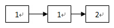
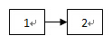
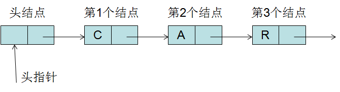

\centering
# __中山大学计算机学院本科生实验报告__
### （__2025学年第1学期）__
\raggedright 
#### __课程名称：数据结构与算法实验　　　任课教师：张子臻__
| | | | |
|:---:|:---:|:---:|:---:|
|年级|2024级|专业（方向）|计算机科学与技术（人工智能与大数据）|
|学号|242325157|姓名|梁玮麟|
|电话|18620062182|Email|3371676041@qq.com|
|开始日期|2025.9.24|结束日期|2025.9.28|  
  

## __第一题__

### 1、实验题目

#### z3-Delete Duplicate

##### 题目描述

已知线性表中的元素以递增有序排列，并以单链表作存储结构。试写一个高效的算法，删除表中所有冗余的结点，即数据域相同的结点只保留一个。

例如对链表：
  

进行操作，将得到：


链表结点定义如下：

```cpp
struct LinkNode {
    int data;
    LinkNode *next;
    LinkNode(int d, LinkNode *add_on = NULL) {
        data = d;
        next = add_on;
    }
};
typedef LinkNode *LinkList;
```

请实现函数：

```cpp
void delete_duplicate(LinkList &head);
```

注意内存的回收

##### Hint

只需提交delete_duplicate() 函数

请记得将头文件包含进去，即`#include "LinkNode.h"`

### 2、实验目的

完成删除重复节点的操作，并加深对链表的理解。

### 3、算法设计

#### 设计思路如下：

1. 有很多方法可以完成。比较通用的方法就是用一个哈希表记录每个节点出现次数，如果遍历链表的时候有相同节点，则删掉当前节点；如果没有，则增加节点。算法空间复杂度为`O(n)`，时间复杂度为`O(n)`。
2. 题目要求高效的算法，通解显然不是最优解。考虑到链表是数据依次递增的结构，我采用以下方法：
   1. 从头节点遍历链表，并记录`head`节点为指针`prev`；
   2. 用指针`t`记录当前节点，如果`t->data == prev->data`则删除当前节点，否则让`prev`指针指向`t`指针指向的节点
   3. 如果`t->next`不为空，则让`t`指向`t->next`，否则说明链表已经遍历完毕，结束循环。

#### 细节注意:

- 如果只有一个节点，需要直接返回，否则`head->next`会报错。
- 释放内存时需要先用一个指针指向`t->next`，否则释放内存后再用`t=t->next`会报错。
  
#### 具体实现：

```cpp
//z3-Delete Duplicate
#include <iostream>
#include "LinkNode.h"
#include <map>
using namespace std;
void delete_duplicate(LinkList &head) {
    if (head == NULL){//头节点为空需要直接返回，否则line 9会报错
        return;
    }
    LinkList t = head->next;
    LinkList prev = head;
    while (t) {
        if (prev->data == t->data) {
            prev->next = t->next;
            LinkList temp=t->next;//用temp记录t指向的下一个节点
            //否则delete之后line 16会报错
            delete t;
            t = temp;
        } else {
            prev = t;
            t = t->next;
        }
    }
}
```

### 4、程序运行与测试

#### 运行结果：

- 标准输入：
  
```c++

```

- 实际输出：
  
```c++

1 
1 2 
1 
1 2 3 
1 2 3 10 

```

- 期望输出：
  
```c++

1 
1 2 
1 
1 2 3 
1 2 3 10 

```

### 5、实验总结与心得

- 这一题的关键在于充分利用给出的链表具有升序结构的特性，时间复杂度与通解一样，但是空间复杂度为`O(1)`。
  

## __第二题__

### 1、实验题目

#### z3-Insert for single link list with head node

##### 题目描述



带虚拟头结点的单链表结点结构如下：

```cpp
struct ListNode
{
    int data;
    ListNode *next;
};
```

链表类接口如下：

```cpp
class List
{
public:
    List()
    {
        head = new ListNode;
        head->next = NULL;
    }
    ~List()
    {
        ListNode* curNode;
        while( head->next )
        {
            curNode = head->next;
            head->next = curNode->next;
            delete curNode;
        }
        delete head;
    }
    
    //在链表第pos(pos>0)个结点之前插入新结点，新结点的值为toadd
    //链表实际结点从1开始计数。
    //调用时需保证pos小等于链表实际结点数
    void List::insert(int toadd, int pos);

    // Data field
    ListNode *head; //head指向虚拟头结点，head-next指向第一个实际结点
};
```

请实现如下函数：

```cpp
void List::insert(int toadd, int pos)
```

##### Hint

只提交insert函数实现，不需要提交类定义及main函数。

请记得将头文件包含进去，即`#include "ListNode.h"`

### 2、实验目的

完成`insert`函数，加深对链表结构的理解。

### 3、算法设计

#### 设计思路如下：

因为是单向链表，而且已经给出了头指针`head`指针和插入位置`pos`，直接找到对应的位置的前一个位置，然后插入就行。

1. 初始化一个指针`t`指向头节点。
2. 用for循环，用`t`遍历链表并指向对应的节点的前一个节点。
3. 用指针`next`指向`t`的下一个节点。
4. 新开一个指针`cur`并分配内存，并给这个节点的`data`赋值。
5. 操作`t,next,cur`三个节点，让`t->next`指向`cur`，`cur->prev`指向`t`，`next->prev`指向`cur`，`cur->next`指向`next`，完成插入操作。

#### 细节注意：

- `for`循环中，要设置成`for(int i=1;i<pos;i++)`，因为要找到`pos`的前一个位置，如果设置成`int i=0`就会找到了`next`指针指向的位置，而且可能直接指向结尾的`nullptr`。
  
#### 具体实现：

```cpp
//z3-Insert for single link list with head node
#include<iostream>
#include"ListNode.h"
using namespace std;
void List::insert(int toadd, int pos){
    ListNode* t=head;//指向头节点
    for(int i =1;i<pos;i++){
        t=t->next;
    }
    ListNode* next=t->next;
    ListNode* cur=new ListNode;
    cur->data=toadd;
    t->next=cur;
    cur->next=next;

}
```

### 4、程序运行与测试

#### 运行结果：

- 标准输入：
  
```c++
```

- 实际输出：
  
```c++
1 2 3 0 4 5 6 7 8 9 10 11 11 10 9 8 7 6 5 4 3 2 1 

```

- 期望输出：
  
```c++
1 2 3 0 4 5 6 7 8 9 10 11 11 10 9 8 7 6 5 4 3 2 1 

```

### 5、实验总结与心得

- 这一题要实现的也是链表的基本操作，实现难度并不高。只要理解好链表的结构就能顺利完成。
  

## __第三题__

### 1、实验题目


#### z3-Loops in the Linked List

##### 题目描述

给定链表结点类型定义，要求实现check函数返回对于给定链表是否存在环，注意链表的边界情况。

```cpp
struct node{
    node *next;
    int val;
};
```

```cpp
// check if there exists a loop
bool check(node *head){
}
```

##### Hint

只需要提交check函数实现，不需要提交main函数

请记得将头文件包含进去，即`#include "Node.h"`

### 2、实验目的

通过完成习题，掌握快慢指针遍历链表判断是否有环的经典算法，加深对链表的理解。

### 3、算法设计

#### 设计思路如下：

1. 首先判断链表是否为空或者只有一个节点，如果只有一个节点则直接返回`false`。
2. 设置快慢指针`fast`和`slow`，并让`slow`指向`head`，`fast`指向`head->next`。
3. 将`fast`的速度设置为`2`,将`slow`的速度设置为`1`。如果有环，假设环中有$n$个数，那么`slow`第一次走完所有未走过的节点（记作`tail`）所需次数为$$n-1$$,而`fast`从开始的位置第二次遍历到`tail`所需次数为$$(n+n-2)/2=n-1$$。所以无论环中有奇数个还是偶数个元素，保证两个指针最终都会碰到。
4. 用一个`while`循环：
   1. 首先判断`fast`是否等于`slow`，如果相等直接返回`true`。
   2. 如果`fast`,`slow`都不为空，则继续循环：
      - 1. `slow`直接赋值为`slow-next`；
      - 2. 判断`fast->next`是否为空：
        - 如果是，则直接返回`false`；
        - 否则`false=false->next`。
   3. 否则直接跳出循环，返回`false`(因为遇到了链表的末尾如果是环，没有nullptr的结尾)。

#### 细节注意：

- 在一开始判断是否空链表或者只有一个节点的时候，需要把空链表的判断前置，否则链表为空时`head->next`会报错
- 对每一次循环结束时，记得要判断`fast->next`是否为空，否则如果不是环，`fast`正好处于尾节点的时候会报错。
  
#### 具体实现：

```cpp
//z3-Loops in the Linked List
#include <iostream>
#include "Node.h"
using namespace std;
bool check(node *head) {
    if (!head || !head->next)//不能反了
        return false;
    node *fast = head->next;
    node *slow = head;
    while (fast && slow) {
        if (slow == fast)
            return true;
        slow = slow->next;
        if (fast->next) {//防止报错
                fast = fast->next->next;
        } else
            return false;
    }
    return false;
}
```

### 4、程序运行与测试

#### 运行结果：

##### 数据点0

- 标准输入：
  
```cpp
8
14349 1
877 23486 3504 25047 5984 20729 1279 14378 7136 30797 3787 16558 8414 23792 6211 18276 18345 19213 27833 6883 21194 12307 25768 3916 27948 21843 1525 11647 27777 10442 31093 25231 4832 2107 31152 17268 5043 17026 7908 14592 24528 17188 11341 10261 31974 7210 17060 27156 27675 25136 7142 10648 25587 3769 13398 30565 24948 23749 1221 11163 21640 21414 12817 26416 27554 29711 21996 18844 15214 17630 11990 30977 29051 30093 2432 29470 29713 27965 11614 19199 30014 21907 7693 13343 24470 8094 13810 22175 21708 22552 14704 26019 31363 4328 10846 29946 2401 1004 28600 20989 21093 21238 9620 25529 11899 2324 10584 22096 3150 16661 13867 5532 4190 5448 9641 23318 31570 15495 10459 19087 30836 3430 7324 18185 14595 25346 10799 30297 6457 5422 17284 8721 6451 19747 12353 26956 14697 12294 19778 4233 23348 19809 4411 953 2702 20948 17567 16022 5401 21000 28865 3895 4708 16869 19002 26337 16745 27653 6794 11553 24410 32104 27906 18711 23453 31081 737 21781 3349 10736 21181 12393 19619 24554 5924 25462 6380 6134 12420 2570 10077 22369 24136 14315 1645 21845 4932 2995 13602 17485 26963 25566 21463 20428 30782 27170 21052 8783 5088 26879 16030 1920 13704 8086 6761 32428 5279 1982 22507 20855 12939 16981 25946 719 24018 7636 26905 10782 28803 27430 4919 3780 19922 5307 10297 6084 11224 10521 25533 12168 24625 15502 7453 6253 5561 15758 24209 2804 3257 4881 15296 12925 20511 13593 16952 17833 24089 751 1704 11967 16099 20143 4689 4942 32222 16902 17591 32532 14561 59 32156 13855 14803 10604 9006 29234 20090 8987 22656 3946 21134 18921 30775 27681 8210 28832 10118 19 23012 20599 5468 28351 17554 20114 14811 6417 8559 15049 10765 29245 16358 27562 21458 7150 14607 23489 13853 3488 11287 26976 19274 32102 12280 3141 28481 8916 26105 26783 2905 13914 570 25760 9549 15834 28137 5196 21089 17815 24583 32557 13893 29583 29551 28233 26941 25867 24084 22097 2431 2676 11658 12827 31708 30056 11464 24914 8099 19725 22316 24429 31171 23717 31935 26333 6959 28771 31675 21643 18055 29821 13130 24449 6388 2691 5009 30951 14932 2287 28397 26674 22679 6397 28796 30616 29288 26301 23520 17607 13584 5990 31295 2518 29080 31213 22670 29308 27950 9686 15120 20864 4299 31819 27161 19056 15378 16235 15384 17302 16250 13284 212 13352 16815 196 12790 8895 5174 16780 3272 26634 15184 32390 31036 2500 11554 32601 16867 3090 11227 25328 1555 24692 28454 28157 9058 5478 20718 20749 16957 15608 14610 14930 26267 24465 4464 8959 16504 23182 14846 17161 24709 4651 791 29226 9502 31399 8722 6700 29564 15523 21529 7780 4396 30924 9016 23677 12735 28345 437 10871 3268 2838 12192 30190 4083 8451 7850 26784 427 21175 18491 13866 10143 28009 10686 30482 17868 15472 23360 13578 2478 6057 29753 3187 13747 12569 12969 1825 8432 26067 6247 5214 24338 5660 29366 16945 9368 18638 26 15168 7674 10346 20915 6847 21713 31525 3579 31157 26821 26633 6995 27360 2539 26082 16422 23184 29860 31649 29553 91 27772 24493 20170 24146 8574 24994 31987 28090 4455 18887 26143 29087 23219 13612 31567 9261 1012 12525 29379 2541 18840 27022 24956 21554 1725 16516 2731 17077 8263 23286 17257 18556 9775 3524 16040 30720 7965 19145 21866 31374 12858 29533 7985 5870 9023 13342 28342 2883 21715 19953 1757 15922 17683 28739 7145 2886 14450 2197 29932 11923 1731 11063 16770 5018 16020 31059 30655 2925 4798 10286 20070 11796 17978 3499 10076 27438 2614 22033 32348 3547 616 18189 12267 14298 25507 13307 11407 6127 24744 1889 27708 24456 22846 1468 13839 15263 32645 11648 4159 21730 26503 22618 27728 6930 440 25481 24489 23488 22155 959 9566 29259 3030 15662 29295 27964 14069 26887 8177 26497 4314 1504 16398 16502 596 17321 30734 9383 19616 28116 6030 10321 27235 11404 23713 31141 10243 9494 3077 6326 23131 6579 23684 10358 672 2193 3622 31007 16185 10572 421 4562 16080 25524 25633 32126 27049 9169 17173 24324 13618 12068 7306 4249 21980 24368 16266 21099 17194 25913 4312 19591 16903 31564 2014 26618 26973 9855 30695 17206 21731 28282 31118 17848 31287 11830 2166 5864 21548 25093 10556 31809 22629 5843 11178 25265 27427 24235 23854 5955 17755 28285 29435 268 18718 6092 32257 16335 7056 27009 19971 8112 11908 12838 9172 29244 4381 30943 3161 27099 24823 1644 2213 12640 21352 22872 355 8671 25605 10867 2420 2750 19560 5507 13274 16399 10545 14903 213 25373 28747 26972 9803 6469 7281 12883 14189 9480 12784 25795 28568 5470 174 23179 9337 32588 18283 7675 9077 30136 7239 16451 32328 13181 16004 29739 2796 11195 13710 16645 6844 29808 24888 25056 11481 16205 24393 9471 8141 21698 27191 24458 9838 17756 5426 18818 1029 17744 2404 22010 21424 26200 10360 23429 24325 9149 14425 8427 18424 29877 31804 8736 2559 22768 24288 8566 5748 4974 4628 22801 4154 1939 18299 24731 27299 27773 26252 6970 28561 19093 25564 16831 28892 30564 7584 23841 10484 937 24941 17705 3784 20392 32579 30574 8422 14788 3530 23172 27619 6992 17371 16753 20477 1955 2882 17248 18943 362 12483 15258 17253 6723 21851 1457 11713 12423 1223 18942 27997 16230 5451 28238 22306 30010 13484 32473 1045 18046 9076 2543 24732 30630 29959 14942 25369 11031 18240 9802 32459 9183 14985 28617 897 4199 10808 4390 7527 19206 20872 1823 25464 3523 27855 8723 1662 6728 29375 26890 5509 30380 8544 28922 9339 11963 16036 27677 20607 4003 13643 25415 25577 19441 30980 6519 31626 7100 30165 19884 4405 11552 3772 20218 3965 30959 28567 5852 21185 20386 13889 24012 15206 12950 14078 24081 13668 19829 24601 14553 22788 9201 203 12679 2280 18361 30559 13134 12619 10917 2708 21759 3210 24884 29251 20255 4323 26937 21313 6205 27517 18641 12935 7042 11433 6552 9104 15754 2408 21533 13827 9074 22061 28563 26258 28723 10697 5922 27694 50 2908 21036 19208 9727 31787 23907 951 4914 31755 24471 28381 5819 21436 7641 8021 4567 21020 10508 27035 27563 18963 3458 16879 6248 10738 9701 4617 6293 9022 27336 22087 9061 19310 10907 14059 17765 11498 30192 13004 12383 26469 3715 25163 17022 10861 18295 26249 2228 15936 15074 22743 16473 3810 30860 20078 7189 28012 4596 17505 20479 31655 10132 1999 10502 30169 23398 28253 13201 20191 19623 29411 13666 21116 219 2662 32448 16881 17735 22229 7886 6760 4281 1877 6151 17618 11384 19296 19786 19224 10425 9642 23696 8479 92 25049 28147 9065 17710 24286 1466 12904 1227 4045 17637 12042 6702 16574 9995 28765 16682 9258 10214 20395 21469 22390 21522 24628 11610 19193 5596 28962 30191 1111 8356 23393 2475 31480 11142 25009 10270 6328 22266 20832 13024 6966 32479 29781 3926 30237 23701 21038 18960 7509 25590 15155 11982 14323 16593 2240 23305 12510 10373 30862 15398 3120 27086 19764 15856 11231 11998 22510 15685 18332 9648 20380 4879 7163 665 6414 19319 5333 4384 25726 23893 30443 18191 17502 30186 19659 8533 11473 6904 13792 12164 13363 8005 18656 18701 22843 8066 11630 20950 26825 2906 20885 2186 19563 30076 20319 26849 29577 10233 16291 802 23775 22509 12063 27878 21552 15458 27078 12062 14393 3185 4187 21847 23781 10410 11327 573 23999 29623 29868 7739 16210 28209 10458 27136 15962 30807 27124 10322 7625 27544 5709 26193 21770 1152 31598 24101 6442 20883 29472 22673 2723 19241 19348 29132 102 10693 25428 7767 26631 22415 26266 5701 20433 27825 4087 29984 25256 25911 21890 20582 8541 15042 5673 26591 30444 28010 20081 3978 19108 23892 23481 30167 32136 25223 1219 6678 22262 5883 27504 1840 9350 1779 19403 9877 15245 11337 16245 30659 21400 25424 30259 13401 7845 5621 24599 14703 28257 5130 27629 4642 13656 15080 2704 12479 7209 10169 9360 29861 266 13472 25472 15911 27598 4016 11381 20502 32214 22364 23658 10898 12688 27622 9187 2079 13118 29978 17873 12540 14073 28731 15798 6320 28661 23102 4361 31205 3334 18998 20444 25721 24163 4112 2236 29139 2219 11136 13273 4979 26917 12091 22887 12237 25703 30531 344 28555 16975 27098 27618 13125 3676 23623 18968 14401 955 1440 8291 18037 10786 4768 7941 26342 19459 6814 22632 30700 19880 13005 1727 7547 2944 11506 16267 13982 18881 22647 100 18208 18257 22971 30966 10636 2989 13898 7513 10606 8089 4935 1374 6314 28482 4728 27276 14621 13616 1295 5851 13356 8011 9002 23685 25470 28585 31062 23923 19109 8101 20305 26356 21504 14641 27669 13749 21727 23149 23313 13806 7401 6008 5818 5081 11909 15426 12392 12242 16946 11431 20023 13739 3606 16112 2752 9768 18841 26548 30670 15670 11529 31195 26932 22957 19690 19134 
```

- 实际输出：
  
```cpp
YES
YES
NO
NO
NO
NO
NO
YES

```

- 期望输出：
  
```cpp
YES
YES
NO
NO
NO
NO
NO
YES
```

##### 数据点1

- 标准输入：
  
```cpp
5
0 0
1 0
1
2 1
1 1
2 0
1 2
3 1
1 2 1
```

- 实际输出：
  
```cpp
NO
NO
YES
NO
YES

```

- 期望输出：
  
```c++
NO
NO
YES
NO
YES
```

### 5、实验总结与心得

- 这一题学到真东西了，第一次见到快慢指针的写法，设计的很巧妙，完全利用了环的特点。
- 另外，我的算法还可以优化。在对`fast`进行更新的时候，判断`fast->next`是否为空时，我还应该判断`fast->next`是否等于`slow`，让程序更高效。
  
  
## __第四题__

### 1、实验题目

#### z3-Remove for single link list with head node

##### 题目描述


带虚拟头结点的单链表结点结构如下：

```cpp
struct ListNode
{
    int data;
    ListNode *next;
};
```

```cpp
class List
{
public:
    List()
    {
        head = new ListNode;
        head->next = NULL;
    }

    ~List()
    {
        ListNode* curNode;
        while( head->next )
        {
            curNode = head->next;
            head->next = curNode->next;
            delete curNode;
        }
        delete head;
    }

    //在链表第pos(pos>0)个结点之前插入新结点,新结点值为toadd
    //链表实际结点从1开始计数。
    //调用时需保证pos小等于链表实际结点数
    void insert(int toadd, int pos)

    //删除链表的第pos(pos>0)个结点
    //链表实际结点从1开始计数。
    //调用时需保证pos小等于链表实际结点数
    void remove(int pos);

    // Data field
    ListNode *head; //head指向虚拟头结点，head-next指向第一个实际结点
};
```

请实现如下函数：

```cpp
void List::remove(int pos)
```

##### Hint

只提交remove函数实现，不要提交类定义及main函数。

请记得将头文件包含进去，即`#include "ListNode.h"`

### 2、实验目的

通过完成习题，知道从链表中移除节点的操作步骤，加深对链表的理解。

### 3、算法设计

#### 设计思路如下：

因为是单向链表，而且已经给出了头指针`head`指针和插入位置`pos`，直接找到对应的位置的前一个位置，然后删除就行。

1. 初始化一个指针`t`指向头节点。
2. 用for循环，用`t`遍历链表并指向对应的节点的前一个节点。
3. 用指针`cur`指向`t`的下一个节点。
4. 用指针`next`指向`cur`的下一个节点。
5. 操作`t,next,cur`三个节点，让`t->next`指向`next`，释放`cur`指针指向地址的内存，完成删除操作。

#### 具体实现：

```cpp
//z3-Remove for single link list with head node
#include<iostream>
#include"ListNode.h"
using namespace std;
void List::remove(int pos){
    ListNode* t=head;
    for (int i=1;i<pos;i++){
        t=t->next;
    }
    ListNode* cur=t->next;
    ListNode* next=cur->next;
    t->next = next;
    delete cur;

}
```

### 4、程序运行与测试

#### 运行结果：

- 标准输入：
  
```cpp

```

- 实际输出：
  
```cpp
11 10 8 6 4 2 1 

```

- 期望输出：
  
```cpp
11 10 8 6 4 2 1 

```

### 5、实验总结与心得

- 这一题难度比较低，找到对应的位置，然后直接操作即可。
  
## 总结

- 总体都是完成链表的基本操作函数。第三题的快慢指针让我积累了一种新的做题思路。收获还是挺多的。